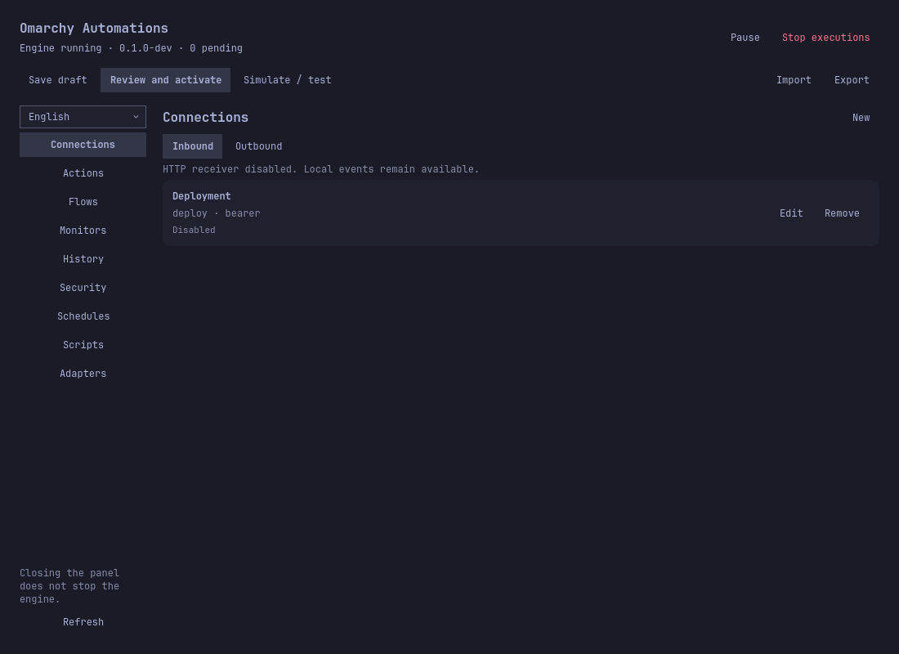
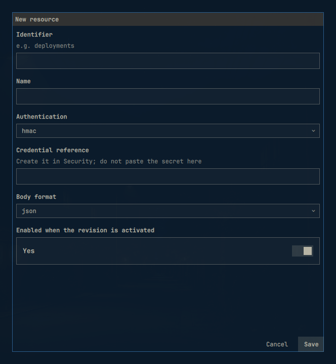
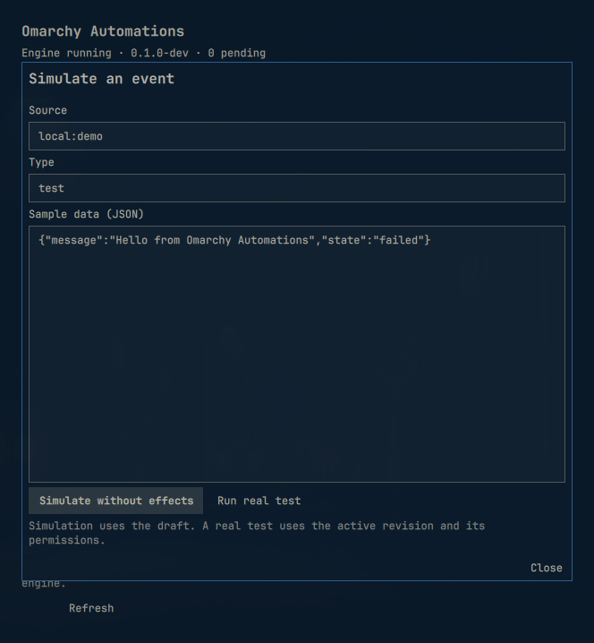
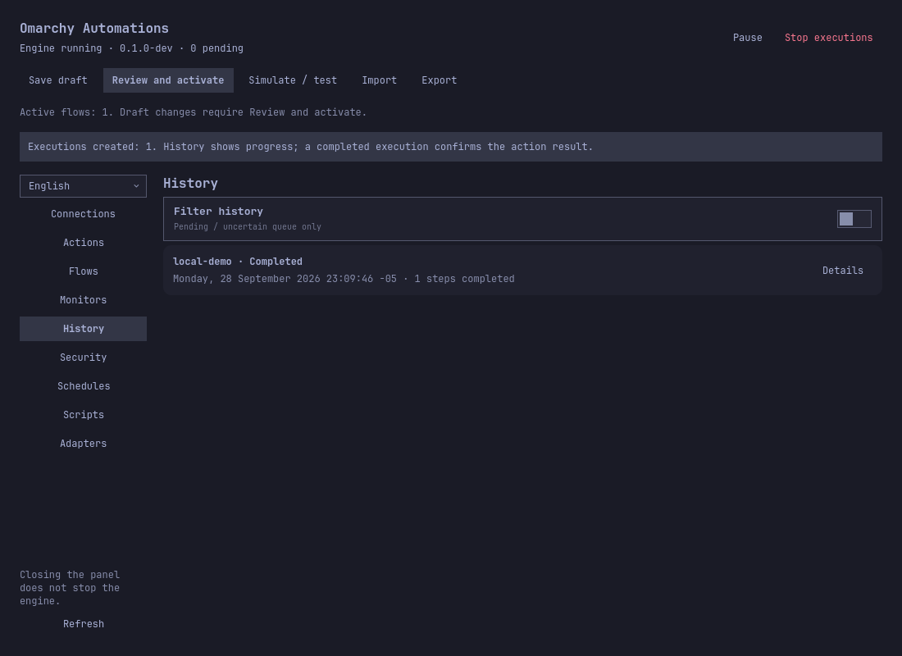

# Omarchy Automations

An automation plugin for Omarchy: connect inbound and outbound webhooks to notifications, services, commands and system monitoring.

Status: **in development, not production-ready**. The engine, CLI and native panel are implemented. Native visual review and bilingual documentation are complete for the current development version. Real Google OAuth and suspend/logout acceptance tests are deferred; final release checks remain tracked in the [roadmap](ROADMAP.md).

The interface defaults to **English**. Users can switch to **Spanish**, and the preference is saved per profile.

## What you can automate

| When this happens… | Omarchy Automations can… |
|---|---|
| A signed GitHub webhook arrives | Show a desktop notification and forward an HTTPS request. |
| Disk space or another monitored metric crosses a threshold | Alert you, then send a recovery event when it returns to normal. |
| An interval or calendar schedule fires | Run an approved script or command and report its outcome. |
| An Omarchy hook or local event arrives | Apply conditions and run a reviewed sequence of actions. |

Build a draft → simulate an event → review permissions → activate the flow.
History shows execution and delivery status, including failures and uncertain outcomes.


*Connections panel in the Tokyo Night theme, rendered with disabled example data.*

| Configure a webhook | Simulate before activating |
|---|---|
|  |  |

*The editor and simulation dialog are captures from the installed Omarchy shell.
More light/dark and English/Spanish screenshots: [[en]](docs/en/interface.md) · [[es]](docs/es/interface.md).*

## Install — no Go compiler needed

**Linux amd64 · Omarchy Quattro · Python 3.** The prebuilt preview includes the
engine and CLI. Omarchy supplies the shell and user systemd session; command and
script actions also require Bubblewrap. The installer runs as your desktop user.

```bash
omarchy plugin add https://github.com/PuroDelphi/omarchy-automations.git --yes
python3 ~/.config/omarchy/plugins/quatrro.automations/scripts/setup.py
```

The first command clones the plugin without enabling it. The second downloads
**Preview 4**, verifies the archive and file checksums, installs the engine and
CLI, then enables the service and widget. Click the connections icon in the bar.
The download comes from this repository's [GitHub Releases](https://github.com/PuroDelphi/omarchy-automations/releases).
No Go compiler, sudo or manual service configuration is needed.

If you already installed an earlier development build with `scripts/install.py`,
keep that installation and update from its source checkout using
`python3 scripts/setup.py --update`. Do not add a second plugin with the same ID.
The installer refuses to mix management modes or replace locally modified files.

Verify the engine:

```bash
systemctl --user status quatrrod.service
~/.local/bin/quatrroctl status
```

Full installation, offline use, source builds and troubleshooting:
[[en]](docs/en/installation.md) · [[es]](docs/es/installation.md).
`quatrro.automations` remains the compatible technical ID; the displayed name is
**Omarchy Automations**. The optional administrative broker is installed separately.

## Try your first automation

1. Open **Actions** and create a `notify` action named `notice`, with title
   `Omarchy Automations` and message `{{data.message}}`.
2. Open **Flows** and create an enabled flow with source `local:demo` and step `notice`.
3. Save the draft. Open **Simulate / test**, use source `local:demo`, type `demo`
   and sample data `{"message":"Hello from Omarchy Automations"}`.
4. Choose **Simulate without effects**. No notification or History entry is created.
   Close the simulation dialogs, click **Review and activate** in the toolbar,
   review the flow/source/notification capability, then click **Authorize and activate**.
   Wait for the activation confirmation and **Active flows: 1**.
5. Reopen **Simulate / test**, choose **Run real test** and confirm. The panel opens
   **History**; expect **Executions created: 1**, then **Completed**.



Follow the illustrated user guide for credentials, inbound webhooks and more:
[[en]](docs/en/user-guide.md) · [[es]](docs/es/user-guide.md).

## Update

Review current work in History, then update the Omarchy checkout and its runtime:

```bash
omarchy plugin update quatrro.automations
python3 ~/.config/omarchy/plugins/quatrro.automations/scripts/setup.py --update
```

Setup downloads the release selected by that checkout, checks that the UI and
runtime match, stops the engine and installs them. It records backups and
preserves data and credentials. An incompatible checkout is rejected before
runtime installation. Omarchy's update command alone only updates the panel.

## Disable or uninstall

Hide the panel while leaving automations running:

```bash
omarchy plugin disable quatrro.automations
```

Show it again with `omarchy plugin enable quatrro.automations`. To stop the engine
as well, run `systemctl --user stop quatrrod.service`.

For the recommended Omarchy installation, remove the runtime first, then the plugin:

```bash
python3 ~/.config/omarchy/plugins/quatrro.automations/scripts/setup.py --uninstall
omarchy plugin remove quatrro.automations
```

Configuration, history, credentials and backups are preserved. The first command
stops/disables the service and removes its verified files; the second removes the
Omarchy checkout. Review any local checkout edits before confirming removal.
For an older installer-managed installation, run `python3 scripts/setup.py --uninstall`
from its original source checkout; it removes both runtime and installed panel.
Separately installed hooks and the optional broker have
[their own removal steps](docs/en/system-integration.md).

## Troubleshooting and current limits

- **Panel disconnected:** check `systemctl --user status quatrrod.service` and
  `~/.local/bin/quatrroctl status`. Engine, CLI and UI must come from the same build.
- **Simulation works but nothing runs:** review enabled resources, active revision,
  permissions, pause state and History. Saving a draft alone does not activate it.
- **No notification:** check the desktop notification service and do-not-disturb mode.
- **Remote webhooks:** the listener defaults to loopback; exposing it requires an
  explicit network/TLS setup. See the security guide [[en]](docs/en/security.md) · [[es]](docs/es/security.md).
- **Google and session recovery:** real OAuth consent/renewal and physical
  suspend/logout acceptance tests remain deferred. This is `0.1.0-dev`, not a stable release.

Report reproducible problems in [GitHub Issues](https://github.com/PuroDelphi/omarchy-automations/issues)
with your version, Omarchy version, steps and redacted errors. Do not attach tokens,
credential files or unreviewed database/configuration exports.

## Documentation

Choose a language for each guide. English is listed first throughout.

| Guide | Languages |
|---|---|
| Installation | [[en]](docs/en/installation.md) · [[es]](docs/es/installation.md) |
| Documentation index | [[en]](docs/en/README.md) · [[es]](docs/es/README.md) |
| User guide: installation and troubleshooting | [[en]](docs/en/user-guide.md) · [[es]](docs/es/user-guide.md) |
| Interface, language and screenshots | [[en]](docs/en/interface.md) · [[es]](docs/es/interface.md) |
| Options reference | [[en]](docs/en/options.md) · [[es]](docs/es/options.md) |
| Use cases | [[en]](docs/en/use-cases.md) · [[es]](docs/es/use-cases.md) |
| Advanced clipboard and file sharing | [[en]](docs/en/clipboard-bridge.md) · [[es]](docs/es/clipboard-bridge.md) |
| Scripts and event adapters | [[en]](docs/en/code-examples.md) · [[es]](docs/es/code-examples.md) |
| GitHub webhook example | [[en]](docs/en/provider-example.md) · [[es]](docs/es/provider-example.md) |
| Service control example | [[en]](docs/en/service-example.md) · [[es]](docs/es/service-example.md) |
| HTTP retries and recovery | [[en]](docs/en/recovery-example.md) · [[es]](docs/es/recovery-example.md) |
| Google OAuth example | [[en]](docs/en/oauth-example.md) · [[es]](docs/es/oauth-example.md) |
| System integration and Omarchy hooks | [[en]](docs/en/system-integration.md) · [[es]](docs/es/system-integration.md) |
| Security | [[en]](docs/en/security.md) · [[es]](docs/es/security.md) |
| Performance | [[en]](docs/en/performance.md) · [[es]](docs/es/performance.md) |
| GitHub setup and publishing | [[en]](docs/en/github.md) · [[es]](docs/es/github.md) |
| Monitor recipes | [[en]](docs/en/monitor-recipes.md) · [[es]](docs/es/monitor-recipes.md) |
| Action recipes | [[en]](docs/en/action-recipes.md) · [[es]](docs/es/action-recipes.md) |
| Payload formats and conditions | [[en]](docs/en/payload-recipes.md) · [[es]](docs/es/payload-recipes.md) |
| Webhook authentication | [[en]](docs/en/authentication-recipes.md) · [[es]](docs/es/authentication-recipes.md) |
| Development release notes | [[en]](docs/en/release-notes.md) · [[es]](docs/es/release-notes.md) |
| Acceptance tests with the user | [[en]](docs/en/external-acceptance.md) · [[es]](docs/es/external-acceptance.md) |

## Technical references

| Reference | Languages |
|---|---|
| Product name and compatibility identifiers | [[en]](docs/en/product-name.md) · [[es]](docs/es/product-name.md) |
| Development packages | [[en]](docs/en/packages.md) · [[es]](docs/es/packages.md) |
| Architecture | [[en]](docs/en/architecture.md) · [[es]](docs/es/architecture.md) |
| Control protocol | [[en]](docs/en/protocol.md) · [[es]](docs/es/protocol.md) |
| Event formats | [[en]](docs/en/formats.md) · [[es]](docs/es/formats.md) |
| LAN access | [[en]](docs/en/lan.md) · [[es]](docs/es/lan.md) |
| Omarchy hooks | [[en]](docs/en/hooks.md) · [[es]](docs/es/hooks.md) |
| Scheduling | [[en]](docs/en/scheduling.md) · [[es]](docs/es/scheduling.md) |
| Webhook providers | [[en]](docs/en/providers.md) · [[es]](docs/es/providers.md) |
| System monitoring | [[en]](docs/en/monitoring.md) · [[es]](docs/es/monitoring.md) |
| Delivery recovery | [[en]](docs/en/recovery.md) · [[es]](docs/es/recovery.md) |
| Command isolation | [[en]](docs/en/command-isolation.md) · [[es]](docs/es/command-isolation.md) |
| Directory access | [[en]](docs/en/directory-access.md) · [[es]](docs/es/directory-access.md) |
| Typed scripts | [[en]](docs/en/scripts.md) · [[es]](docs/es/scripts.md) |
| OAuth 2 | [[en]](docs/en/oauth2.md) · [[es]](docs/es/oauth2.md) |
| External adapters | [[en]](docs/en/external-adapters.md) · [[es]](docs/es/external-adapters.md) |
| Operations | [[en]](docs/en/operations.md) · [[es]](docs/es/operations.md) |
| Network exposure | [[en]](docs/en/exposure.md) · [[es]](docs/es/exposure.md) |

Historical engineering records: [Roadmap](ROADMAP.md), [validation evidence](docs/validation.md), [verified compatibility](docs/compatibility.md).

## AI assistants

The runtime includes an **Omarchy Automations** skill for agents with authorized
terminal access. It uses the installed CLI; no source checkout or Go is needed.
[Setup and examples: English](docs/en/ai-assistants.md) · [Español](docs/es/ai-assistants.md).

## Support this project

Omarchy Automations is open source. If it helps your workflow, you can support
its maintenance through [GitHub Sponsors](https://github.com/sponsors/PuroDelphi)
or [PayPal](https://www.paypal.com/donate/?hosted_button_id=KBAUBYYDNHQNQ).
Donations are optional and do not change the MIT license.

[](https://www.paypal.com/donate/?hosted_button_id=KBAUBYYDNHQNQ)

For questions, bug reports and security disclosures, see [Support](SUPPORT.md).

## Development

For source builds, isolated profiles and tests, see the development guide
[[en]](docs/en/development.md) · [[es]](docs/es/development.md).
Normal installation uses prebuilt binaries and does not require Go.

## License

[MIT](LICENSE). Dependency notices are preserved in
[third-party notices](docs/third-party-notices.md).
