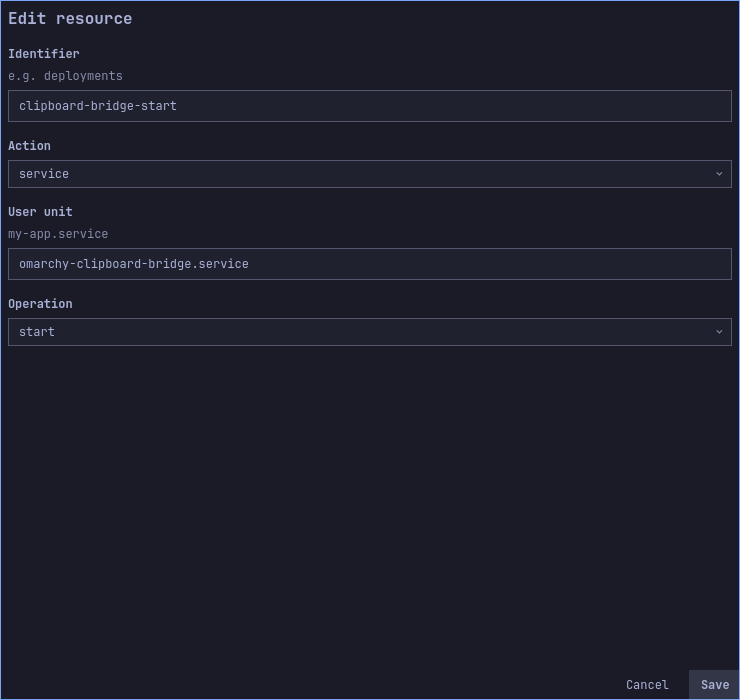
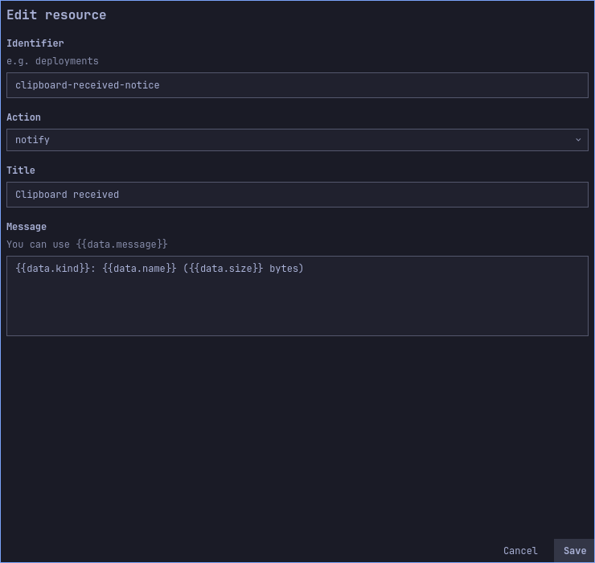
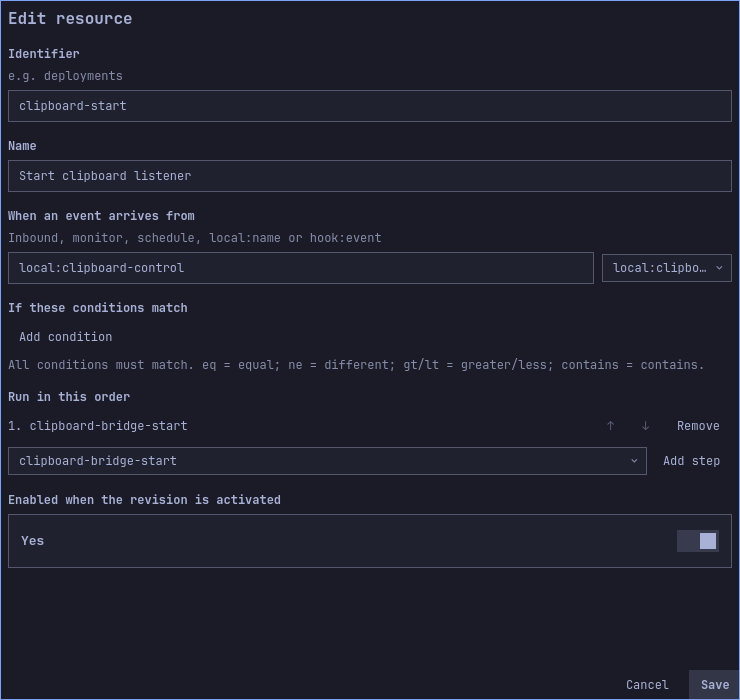
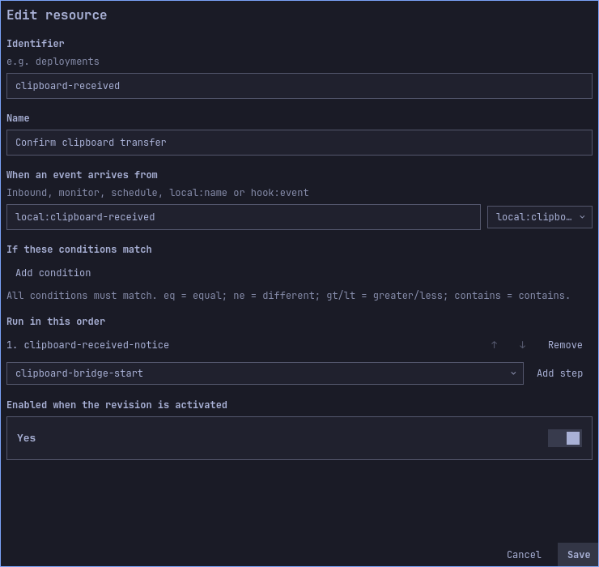
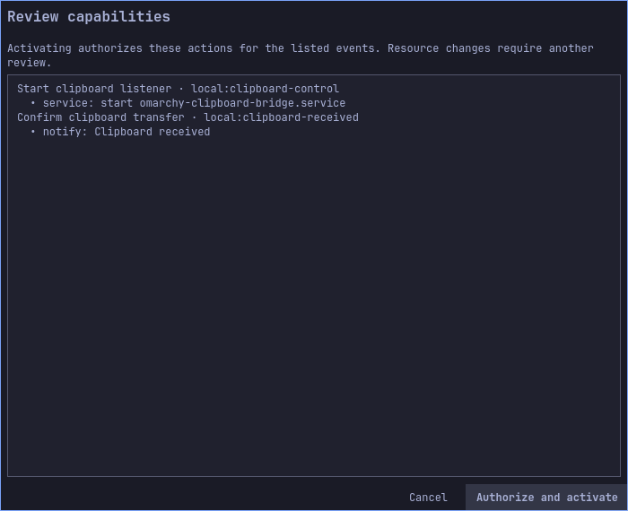
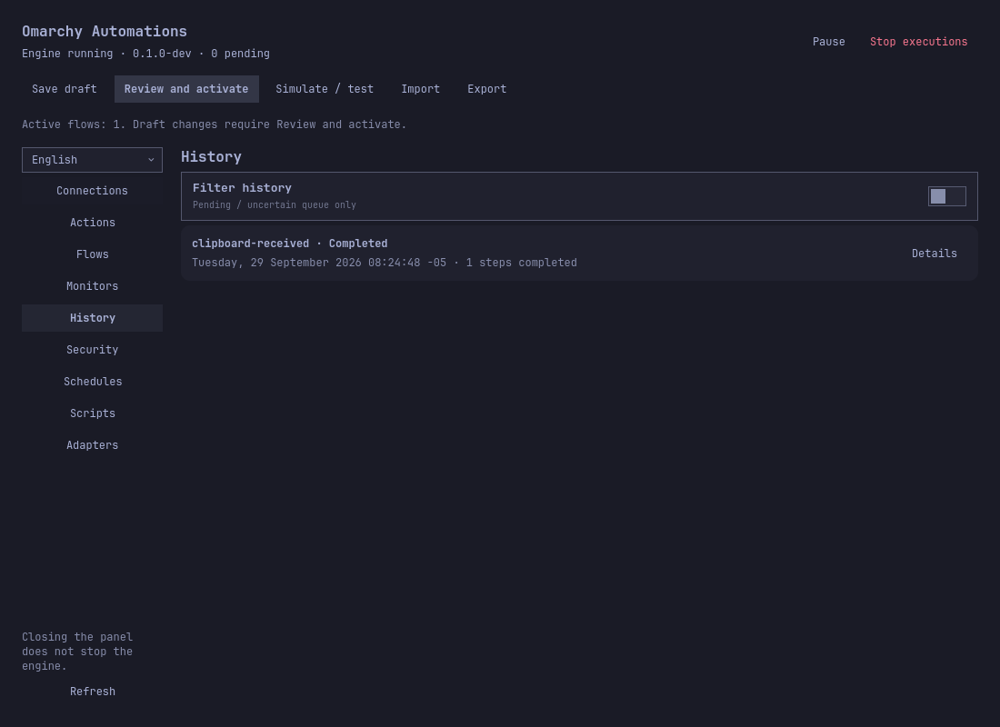

# Advanced walkthrough: share text and files through a clipboard listener

[Español](../es/clipboard-bridge.md) · [User guide](user-guide.md) · [Security](security.md)

**Result:** another computer sends text or a file through an SSH tunnel. The
receiving Omarchy desktop places text in its Wayland clipboard, or saves the file
under `~/Downloads/ClipboardInbox` and puts a file URI on the clipboard. Omarchy
Automations starts the listener on request, records each successful transfer as a
local event, and shows a notification plus an execution in History.

This is an **advanced companion example**, not a built-in `clipboard` action.
The current plugin's webhook accepts at most 256 KiB, multipart files at most
64 KiB each, and does not save attachments to the host. Its isolated command and
script actions cannot access the Wayland socket. The supplied user service handles
the clipboard and file bytes; the plugin controls that exact service and processes
receipt events. The example caps each transfer at **32 MiB**. Files are shared as
`text/uri-list` pointing to a saved local file; applications that do not accept
file URIs may require opening the inbox manually. This is push-to-receiver, not
continuous clipboard synchronization.

## 1. Install the companion on the receiving desktop

First [install Omarchy Automations](installation.md). The commands below use the
Git-managed plugin checkout, Python 3, `wl-copy`, systemd user services and an
active Wayland session. Run as your desktop user. They create only the example's
script, private token/inbox and dedicated user unit:

```bash
plugin="$HOME/.config/omarchy/plugins/quatrro.automations"
mkdir -p "$HOME/.local/libexec/omarchy-automations" "$HOME/.config/systemd/user"
install -m 700 "$plugin/examples/clipboard-bridge/clipboard_bridge.py" \
  "$HOME/.local/libexec/omarchy-automations/clipboard_bridge.py"
install -m 600 "$plugin/examples/clipboard-bridge/omarchy-clipboard-bridge.service" \
  "$HOME/.config/systemd/user/omarchy-clipboard-bridge.service"
python3 "$HOME/.local/libexec/omarchy-automations/clipboard_bridge.py" init
systemctl --user import-environment WAYLAND_DISPLAY XDG_RUNTIME_DIR
systemctl --user daemon-reload
```

`init` refuses to replace an existing token. The service binds only
`127.0.0.1:8786`, and it is **not enabled at login**. The receiving machine's
Wayland session must export `WAYLAND_DISPLAY` to the user manager. Check with
`systemctl --user show-environment`; repeat `import-environment` after logging
into a new session if required. Do not expose port 8786 directly on the LAN.
The sender will use SSH forwarding and the separate bearer token.

## 2. Create the two actions

In **Actions**, create a `service` action with ID `clipboard-bridge-start`, user
unit `omarchy-clipboard-bridge.service`, and operation `start`. This starts the
installed user service; it does not install or enable it at login.



Create a `notify` action with ID `clipboard-received-notice`, title
`Clipboard received`, and body
`{{data.kind}}: {{data.name}} ({{data.size}} bytes)`. This notification contains
metadata only, never clipboard text or file contents.



## 3. Create the flows and simulate

In **Flows**, create `clipboard-start`: source `local:clipboard-control`, enabled,
step `clipboard-bridge-start`. A local event will start the listener.



Create `clipboard-received`: source `local:clipboard-received`, enabled, step
`clipboard-received-notice`. The companion emits this event only after
`wl-copy` succeeds. Use the exact IDs above; the companion's source is fixed.



Save the draft. In **Simulate / test**, try source `local:clipboard-control`, type
`start`, data `{}`. Expect the service step to match, with **no listener started**.
Simulate `local:clipboard-received`, type `file`, data
`{"kind":"file","name":"report.pdf","size":4096}`. Expect the notification
text to resolve. Simulation creates no History entry and does not touch the
clipboard. If you already have other automations, create these four resources in
your existing draft; importing a file replaces the whole draft.

For a disposable profile or a new empty draft, the exact configuration is
[automation.json](../../examples/clipboard-bridge/automation.json). Importing it
leaves both flows disabled: enable them before review. Do not import it into a
profile with work you want to preserve.

## 4. Review and activate

Click **Review and activate** in the top toolbar. Confirm it lists the exact
service `start` capability for `local:clipboard-control` and notification
capability for `local:clipboard-received`. Click **Authorize and activate**.
Saving and simulating alone do not activate either flow.



The images show a saved draft with both flows enabled, followed by the review
dialog in an isolated profile. The listener was not started for these captures.

## 5. Start the listener with Omarchy Automations

The following is a **real** event and starts the user service because the start
flow is active. Run it on the receiving desktop:

```bash
quatrroctl emit --stdin <<'JSON'
{"source":"local:clipboard-control","type":"start","data":{}}
JSON
systemctl --user status omarchy-clipboard-bridge.service
```

Wait for the unit to be active and `Clipboard bridge listening on
127.0.0.1:8786` in `journalctl --user -u omarchy-clipboard-bridge.service -n 20`.
History should show `clipboard-start` completed. If it fails, open **Details**;
check the unit name, `WAYLAND_DISPLAY` and that the token file is mode 0600.

## 6. Connect a second computer and send data

On the **sending** computer, open an SSH tunnel to the receiving desktop. Replace
`user@receiver` with your SSH account and host. Keep this terminal open:

```bash
ssh -o ExitOnForwardFailure=yes -N -L 8786:127.0.0.1:8786 user@receiver
```

In another terminal, copy the supplied client script and token through the same
trusted SSH connection. The token is a credential; keep its directory private:

```bash
mkdir -p "$HOME/.config/omarchy-automations"
chmod 700 "$HOME/.config/omarchy-automations"
scp user@receiver:~/.local/libexec/omarchy-automations/clipboard_bridge.py ./clipboard_bridge.py
scp user@receiver:~/.config/omarchy-automations/clipboard-bridge.token \
  "$HOME/.config/omarchy-automations/clipboard-bridge.token"
chmod 600 "$HOME/.config/omarchy-automations/clipboard-bridge.token"
```

Send text from the sender's clipboard (or replace `wl-paste` with `printf`):

```bash
wl-paste --no-newline | python3 ./clipboard_bridge.py send-text \
  --token-file "$HOME/.config/omarchy-automations/clipboard-bridge.token"
```

Send **any regular file up to 32 MiB**, including binary files:

```bash
python3 ./clipboard_bridge.py send-file "$HOME/Pictures/example.png" \
  --token-file "$HOME/.config/omarchy-automations/clipboard-bridge.token"
```

The response should include `"accepted": true` and
`"automation_event_sent": true`. The latter means the companion successfully
submitted an event to the engine; look for the completed action in History. If
it is `false`, the clipboard operation happened but the engine event failed: inspect
`quatrrod.service`, then check the clipboard/inbox before deciding to resend.

For a file, verify it appears in `~/Downloads/ClipboardInbox` with a unique
prefix. Pasting into a compatible file manager should paste the saved file. A
text transfer replaces the current text clipboard contents. This does not grant
the sender access to read the receiving clipboard or files.



This History capture uses a private profile and a substitute notification command
to avoid altering the author's real desktop; the engine really activated the
receipt flow and completed an execution. The receiver was also tested end to end with the real Omarchy Automations engine
and substitutes for Wayland and desktop notifications: two transfers produced
two completed History executions. A remote transfer between two physical
desktops and each application's paste behavior require your own acceptance test.

## Troubleshooting and shutdown

| Symptom | Check |
|---|---|
| `connection refused` | The SSH tunnel, port 8786 and user service state. |
| `401 unauthorized` | Token file copied from this receiver, private mode, no extra whitespace. |
| `413` | Transfer exceeds 32 MiB; choose another file-sharing method. |
| `503 clipboard unavailable` | Receiving Wayland session and imported `WAYLAND_DISPLAY`; inspect user journal. |
| HTTP accepted, no History row | `automation_event_sent`, active `clipboard-received` flow, its permission and the engine service. |
| File saved but no paste | Application may not support `text/uri-list`; open the inbox directly. |

Stop only this user service when finished; disabling the flow alone does not stop
an already running listener:

```bash
systemctl --user stop omarchy-clipboard-bridge.service
```

Remove the copied token from the sender if it is no longer needed. To remove the
example entirely, stop the service, remove only its dedicated user unit/script,
run `systemctl --user daemon-reload`, and delete its dedicated token/inbox only
after checking whether they contain files you want to keep. Remove or disable the
two example flows/actions from your Omarchy Automations draft and activate the
revised configuration.
