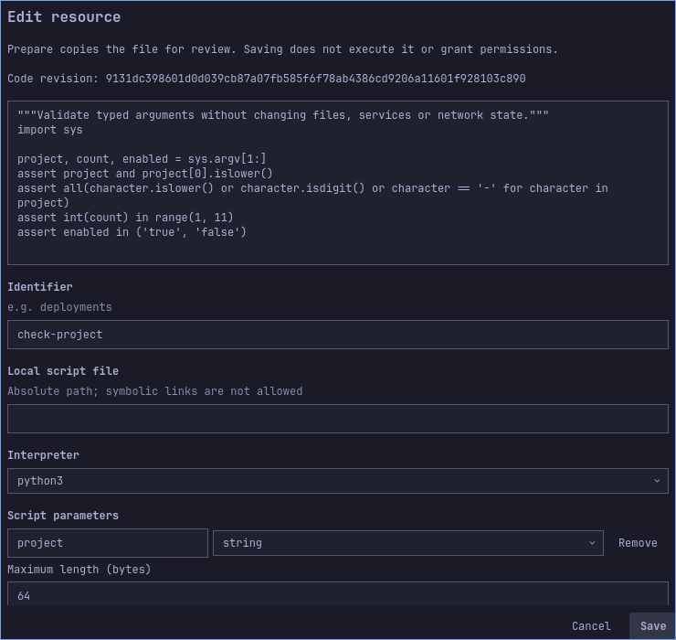
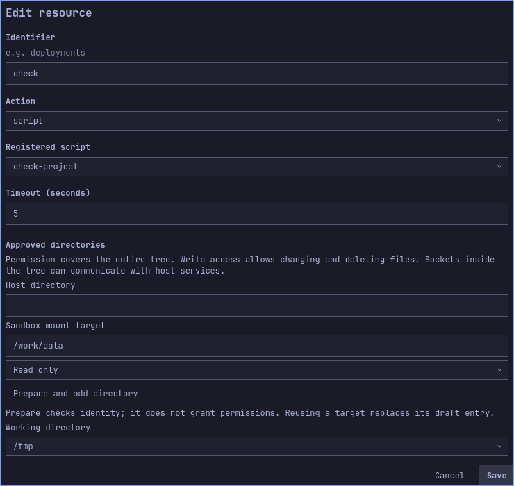
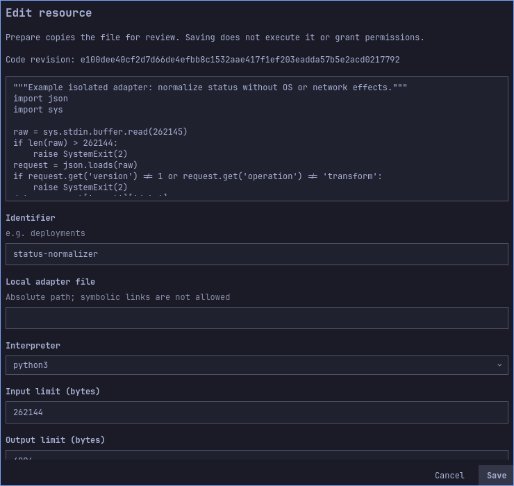
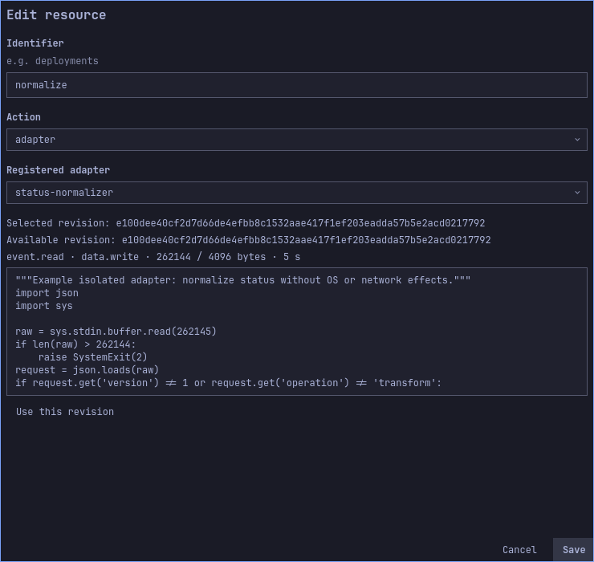

# Scripts and adapters: complete examples

[Español](../es/code-examples.md) · [User guide](user-guide.md) · [Other examples](use-cases.md)

These examples require the engine, a working user systemd manager, Bubblewrap and
Python 3. Importing replaces your draft: export any configuration you wish to keep.
Each file is a complete configuration with a disabled flow. It contains the code
and its validated revision; importing does not execute it or grant permissions.

## Validate typed parameters with a script

Import [typed-script.json](../../examples/use-cases/typed-script.json). Its readable
source is [check-project.py](../../examples/scripts/check-project.py). It validates
arguments and exits; it does not create files, contact a service or display a
notification. A successful execution is visible in History.

The contract has three required parameters, in this argv order:

| Parameter | Contract | Action value |
|---|---|---|
| `project` | String, maximum 64 bytes, full pattern `[a-z][a-z0-9-]*` | Event field `data.project` |
| `count` | Integer, inclusive range 1–10 | Event field `data.count` |
| `enabled` | Boolean | Literal `true` |

1. Open Scripts and inspect `check-project`, its code and prepared revision.
2. Open Actions and inspect `check`. Its revision must match the script, timeout
   is 5 seconds, and it has no approved host directories.
3. Enable flow `validate-project` in the draft and save.
4. Open Simulate / test with source `local:project`, type `test` and:

   ```json
   {"project":"demo-project","count":3}
   ```

   Simulate without effects. Expect arguments `demo-project`, `3`, `true` in that
   order. No script runs during simulation.
5. Repeat with `{"project":"release-2","count":10}`: expect `release-2`, `10`,
   `true`. Then try `{"project":"demo-project","count":11}`: expect a contract
   error, with no execution. Text `"3"` is not the integer `3`.
6. Review and activate the script capability. Run a real test with either valid
   payload and confirm. Expect a completed History execution. No output file or
   notification is expected, and process stdout is not retained in History.

To recreate the configuration through forms instead of importing, create a script
with ID `check-project`, the **absolute local path** to the supplied Python file,
interpreter `python3` and the three parameters above. Choose Prepare revision,
inspect it and Save. Create action `check` of kind `script`, select the script,
choose Use this revision and reset parameters, then set both event bindings and
the boolean literal. Add it to the enabled `local:project` flow, save, simulate,
review and activate.

If you edit the source, prepare a new revision explicitly. Select that revision in
the action and re-enter its values before saving/reviewing. Editing the source
alone never changes the code already stored in an active revision.

### Visual walkthrough

Scripts shows the imported source and revision. Actions pins the revision and maps event fields into typed parameters. Scroll within each form to inspect the remaining fields.





The images show the imported draft before activation. Long forms scroll; fields below the visible area remain part of the configuration.

## Normalize a build event, then notify

Import [adapter-notification.json](../../examples/use-cases/adapter-notification.json).
Its source is [status-normalizer.py](../../examples/adapters/status-normalizer.py),
with [manifest](../../examples/adapters/status-normalizer.json). It accepts one
version-1 JSON request, maps build status to severity and returns data for the
next step. It does not perform operating-system effects itself.

1. Inspect adapter `status-normalizer`: Python 3, input limit 262144 bytes, output
   limit 4096 bytes and timeout 5 seconds. The input includes the protocol envelope.
2. Inspect action `normalize`, which selects that exact adapter revision, followed
   by notification `notice` with body
   `{{data.adapter.severity}}: {{data.adapter.message}}`.
3. Enable flow `normalized-notice`, source `local:build`, with steps `normalize`
   then `notice`. Save the draft.
4. Simulate type `build` with:

   ```json
   {"status":"failed","message":"Build failed"}
   ```

   Expect a matching flow, an adapter result marked unavailable and a notification
   marked as depending on that result. Simulation intentionally does not calculate
   `error: Build failed`. Supplying your own `data.adapter` field does not bypass
   this deferred result.
5. Review both adapter and notification capabilities, activate and confirm a real
   test. Expect notification `error: Build failed` and a completed execution.
6. Test `{"status":"passed","message":"Build passed"}`: expect
   `info: Build passed`. Notifications depend on the desktop notification service;
   check History if the desktop is in do-not-disturb mode.

To build it in forms, create the adapter from the source's absolute path with the
manifest limits above, Prepare revision, inspect and Save. Create an adapter
action and explicitly choose its available revision. Create the notification and
ordered flow shown above. No host directory mounts or network options are offered
to an adapter. The result is stored in this execution's private event view under
`data.adapter`; it does not rewrite the original event for other flows.

A timeout, malformed response or exceeded quota fails the transform and prevents
using its output. Script/adapter failures do not automatically retry. Inspect the
failure, change the code/contract if needed and review a new revision before
sending a new event.

### Visual walkthrough

Adapters shows the imported implementation; Actions selects that adapter. Follow the ordered flow below to pass the adapter result to the notification.





The images show the imported draft before activation. Long forms scroll; fields below the visible area remain part of the configuration.

## What was verified

`TestDocumentedCodeExamples` loads the distributed configurations, verifies their
hashes with the engine, compares embedded code to the readable source, checks that
flows ship disabled and tests simulation plus rejection of an out-of-range count.
No executions, grants or HTTP outbox entries are created by simulation.

`TestHostDocumentedCodeExamples` executes both valid script payloads and both
adapter payloads inside the actual systemd/Bubblewrap isolation and checks the
resolved notification text. It does **not** display desktop notifications or prove
the whole import/activate workflow through the UI; that remains a separate check.
