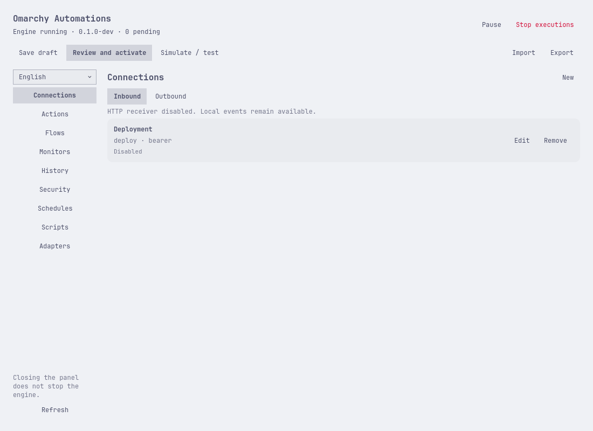
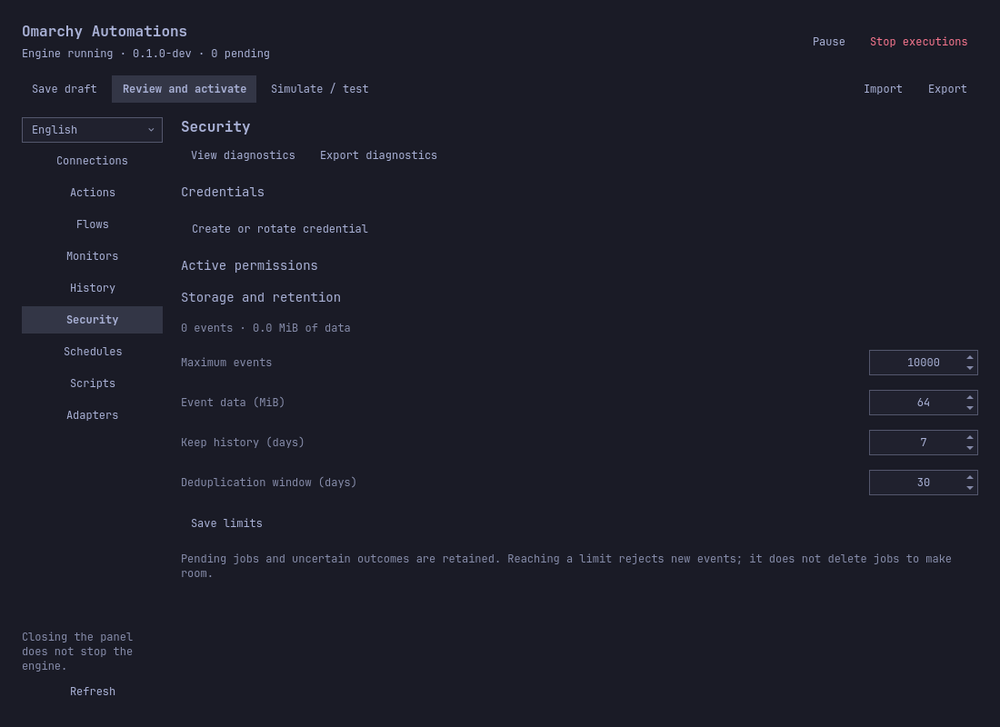
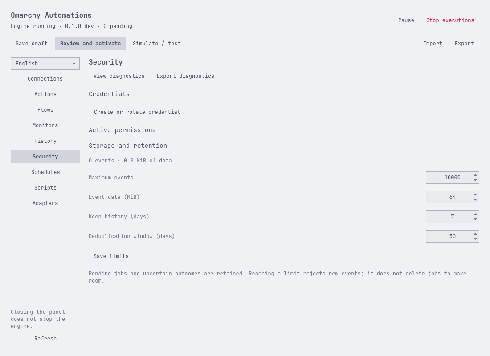
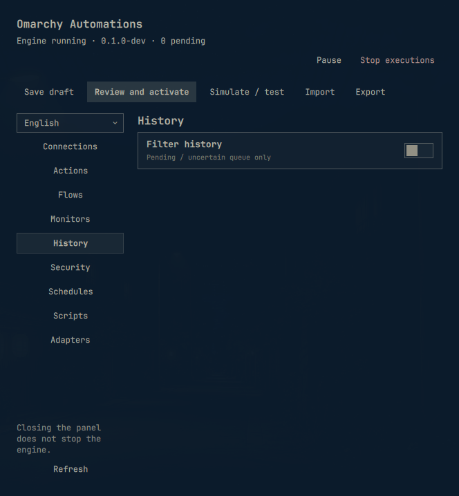
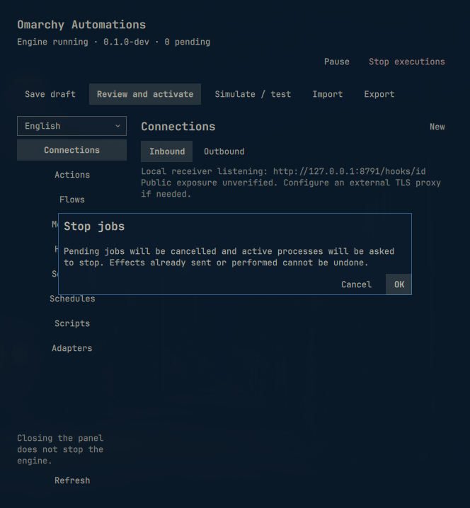

# Interface tour

[Español](../es/interface.md) · [User guide](user-guide.md) · [Every option](options.md)

These screenshots show the development panel with real Omarchy controls and
the installed Tokyo Night (dark) and Catppuccin Latte (light) themes. English is
the default; the sidebar language selector persists your choice of English or
Spanish. Resource names and event data are user content and are not translated.

## Connections

Choose **Inbound** to configure receivers or **Outbound** to configure HTTPS
destinations. **New**, **Edit** and **Remove** change the draft. **Save draft**
persists it; **Review and activate** shows the permissions before applying it.
For example, create a receiver for deployment failures, or register a destination
for disk alerts. Follow the [guided examples](use-cases.md) for both configurations.

The screenshot contains the disabled `Deployment` example. Its HTTP receiver is
disabled in the capture environment; this message describes the listener, not
the individual entry. A normal installation reports its configured listener.

The plugin inherits theme colors, typography and controls. It does not have a
separate theme selector. A different Omarchy theme changes its appearance.

## Security

Use **Create or rotate credential** to store a secret locally. Existing grants
appear under **Active permissions** after activation. In this empty profile
there are no credentials or grants to list.

The four numeric fields control event count, payload size, terminal-history
retention and deduplication. Edit a value directly or use the arrow controls,
then choose **Save limits**. Unlike saving a draft, this applies immediately.
For example, retain terminal history for 14 days while keeping deduplication at
30 days, or increase the event limit to 20000 after investigating a full queue.
See [storage options](options.md#storage.max_events) for allowed values and effects.

## Entry form in the desktop shell

This additional capture comes from the installed plugin in the actual desktop
shell at 664 × 718, using the active desktop theme. Keyboard navigation reached
**New** with Tab and opened it with Enter. The same form was inspected in both
languages, then dismissed with Escape without saving. English was restored.
The fields, native selectors and Cancel/Save footer remain inside the window.
This checks the entry form; the 48-layout development matrix covers other resource
forms separately. No entry, credential or automation was created for this capture.

## Capture provenance and limits

The eight English/Spanish images were generated with `scripts/capture-docs.py`
from the real QML panel at 1100 × 800, using offscreen rendering, a temporary
engine/profile and the distributed webhook example. No flows were activated,
no secret values were loaded, inbound HTTP was disabled and the desktop theme
was not changed. Security-field bounds are checked in each language and theme.
These are documentation captures, not proof of every dialog, small-window layout,
screen-reader behavior or a live desktop session. Their generation and review
are recorded in the [validation log](../validation.md).

## Small windows and navigation

In a narrow window, the header and action toolbar use additional rows so buttons
remain visible. History places its filter description above the pagination
controls. If the sidebar is taller than the available space, scroll it to reach
its last controls. Moving keyboard focus to a sidebar control scrolls that
control into view, including the language selector and Refresh.

This compositor capture shows the updated installed panel at 664 × 718. History
was opened with Tab/Shift-Tab and Return; both language versions were inspected,
then English was restored and the panel closed. The filter description and top
actions fit. No flow was activated or event generated for these captures.

## Installed dialogs

These compositor captures show the native dialog heading, warning text and
footer in the installed shell. Both dialogs were opened with the keyboard and
dismissed with Escape. No stop command, simulation or real event was submitted.
English was restored afterwards. Light/dark development captures separately
verify the heading colors and 120 dialog layouts.

## Native appearance comparison

The historical capture below shows the former name and generic buttons. It is
kept only to document the requested visual redesign. The installed panel uses
native controls and the product name Omarchy Automations.

The automation icon is the first icon in the bar crop. Its native 27 × 26
cell matches neighboring icons. It uses the shell font and sizing; disconnected,
paused and failed states use distinct glyphs with a translated tooltip.
