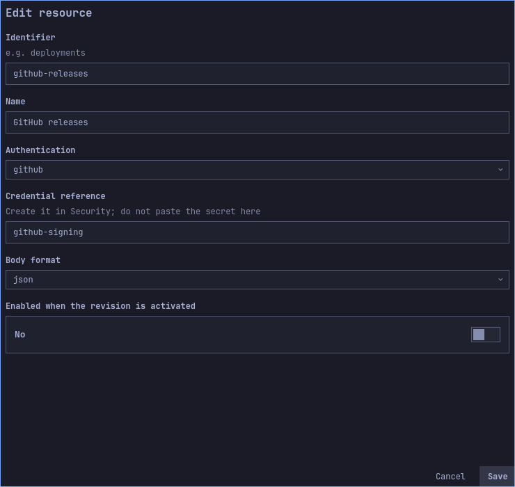
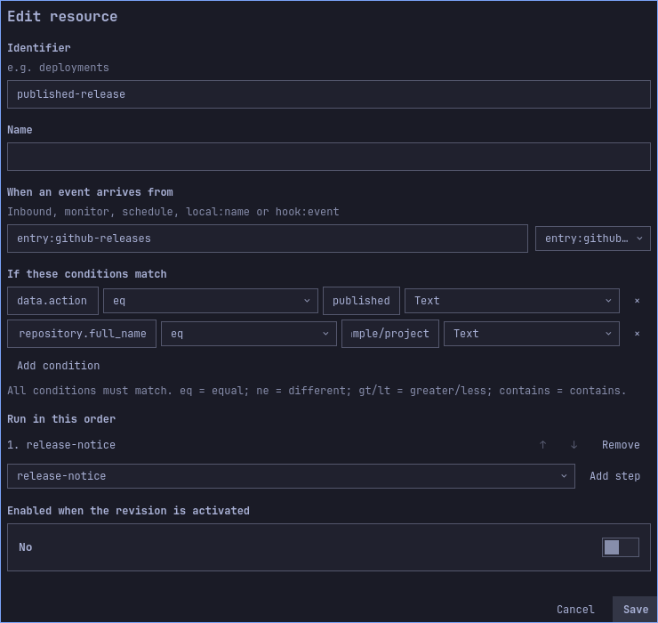

# Signed provider example: GitHub releases

[Español](../es/provider-example.md) · [User guide](user-guide.md) · [Other examples](use-cases.md)

This example notifies when a release is published in one selected repository.
It does not publish a release or upload your project to GitHub. A local fixture
can verify the plugin without a GitHub account; a live integration additionally
needs repository webhook administration and a reachable HTTPS receiver.

## Configure and simulate

1. Export the draft you want to keep, then import
   [github-release.json](../../examples/use-cases/github-release.json).
2. In flow `published-release`, replace the repository condition `example/project`
   with your repository's exact `owner/name`, for example
   `PuroDelphi/omarchy-automations`. Keep `data.action eq published`.
3. Enable that flow and save. In Simulate / test, choose source
   `entry:github-releases`, type `webhook` and the following illustrative body
   (use the repository name chosen in step 2):

   ```json
   {
     "action": "published",
     "repository": {"full_name": "example/project"},
     "release": {"tag_name": "v1.2.0"}
   }
   ```

   Expect one match and notification text `example/project: v1.2.0`.
4. Repeat with tag `v1.2.1`: expect the new tag in the text. Change `action` to
   `created`, or repository to `example/other`: expect no match.

Simulation only tests the flow and templates. It neither checks a signature nor
proves that a remote sender can reach your machine.

### Visual walkthrough

After importing, inspect the GitHub receiver in Connections → Inbound and the repository/action conditions in Flows. Keep the receiver disabled while testing the draft.





The images show the imported draft before activation. Long forms scroll; fields below the visible area remain part of the configuration.

## Connect a real repository

Create a private generic credential `github-signing` in Security. Use the same
value as the repository webhook secret; never put it in this JSON configuration.
GitHub sends the body signature in `X-Hub-Signature-256` using HMAC-SHA256. The
plugin verifies the original bytes before parsing. [GitHub signature contract](https://docs.github.com/en/webhooks/using-webhooks/validating-webhook-deliveries).

Enable entry `github-releases`, review and activate the notification flow. Arrange
a trusted public HTTPS proxy to the engine's loopback listener. The plugin does
not configure DNS/firewall or publish the receiver automatically. Preserve body
bytes and signature/delivery headers; do not expose the Unix control API.

With repository owner/admin access, open **Settings → Webhooks → Add webhook**.
Set your HTTPS URL ending in `/hooks/github-releases`, JSON content type and the
matching private secret. Select release events, keep certificate verification
enabled and create the webhook. [GitHub webhook setup](https://docs.github.com/en/webhooks/using-webhooks/creating-webhooks).

When an actual published-release event arrives, expect HTTP 202 after persistence,
then a notification and a completed execution. A setup ping can be accepted without
matching this release flow. Inspect GitHub's delivery result and plugin History
separately: HTTP acceptance is not proof that the action completed.

## Filtering, repeats and recovery

The plugin deliberately does not trust `X-GitHub-Event` as a signed event type.
Its filter uses `data.action` and `data.repository.full_name` from the signed body.
`X-GitHub-Delivery` is required, but deduplication uses the authenticated body digest.
Repeating an identical body with a different delivery header does not rerun it
within retained deduplication state. Two legitimate byte-identical bodies are also
consolidated. This contract has no signed timestamp, so retention does not establish
indefinite freshness.

For a signature error, compare the credential on both ends and check whether the
proxy changed the body. For an accepted event with no notification, inspect the
repository/action conditions, active revision, grants, pause state and notification
service. Rotating the secret requires updating both ends; an already authenticated
request cannot be undone by rotation.

## Verification boundary

`TestDocumentedGitHubRelease` loads this distributed configuration and uses the
actual ingress handler, credential store, persistence and flow filtering. It checks
valid delivery, changed delivery ID, body tampering, wrong repository and wrong
action. Three distinct valid events create exactly one execution. The worker's
notification runner is replaced to check the resolved text without displaying it.
No real GitHub repository, external proxy or desktop notification is exercised by
that test. A live repository connection remains an explicit deployment step.
