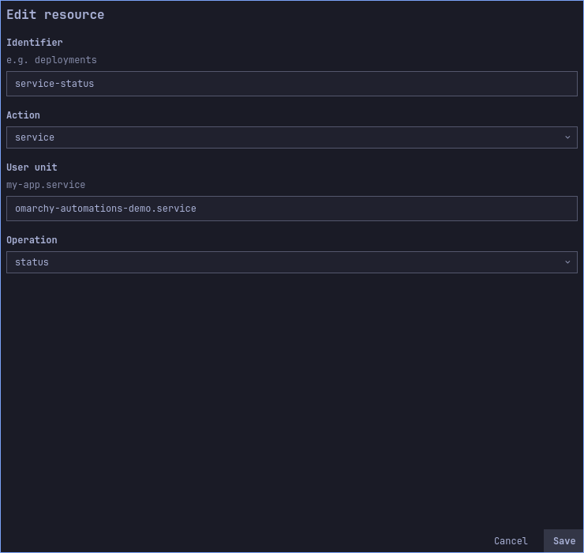
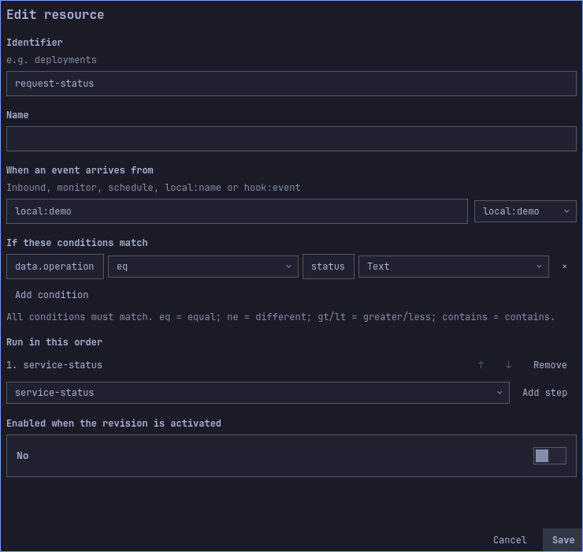

# Control an authorized user service

[Español](../es/service-example.md) · [User guide](user-guide.md) · [Other examples](use-cases.md)

This example offers two fixed operations on one user service: check its active
state and restart it. Event data chooses between two preconfigured flows; it does
not supply a unit name, executable or arbitrary systemctl arguments.

## Prepare a disposable service

You need a working user systemd manager. From a terminal, create the example unit:

```bash
systemd-run --user --unit=omarchy-automations-demo.service --collect --property=Type=exec -- /usr/bin/sleep 1800
systemctl --user is-active omarchy-automations-demo.service
```

Expect `active`. The command refuses to replace an already existing unit of this
name; resolve that conflict before proceeding. This transient service only sleeps
and expires after 30 minutes unless restarted. It is not enabled at login and does
not install a permanent unit file. If it expires during the exercise, recreate it.

## Import and inspect

Export the draft you want to retain, then import
[user-service.json](../../examples/use-cases/user-service.json). Both flows ship
disabled. Inspect these resources:

| Resource | Fixed behavior |
|---|---|
| `service-status` | `service`, unit `omarchy-automations-demo.service`, operation `status` |
| `service-restart` | Same exact unit, operation `restart` |
| `request-status` | Source `local:service`, condition `data.operation eq status`, step `service-status` |
| `request-restart` | Same source, condition `data.operation eq restart`, step `service-restart` |

Enable both flows in the draft, then save. To build it manually, create the two
actions first, then the two flows and text conditions shown in the table. Each
operation has its own reviewed capability.

### Visual walkthrough

Inspect Actions before activating: the operation and exact unit name determine which user service can be controlled. The flow selects when that action runs.





The images show the imported draft before activation. Long forms scroll; fields below the visible area remain part of the configuration.

## Simulate, activate and run

1. Open Simulate / test, source `local:service`, type `test`, and data:

   ```json
   {"operation":"status"}
   ```

   Simulate without effects: only `request-status` should match. It does not
   contact systemd during simulation.
2. Repeat with `{"operation":"restart"}`: only `request-restart` should match.
   With `{"operation":"stop"}`, neither flow matches; this example does not
   authorize stopping through event data.
3. Review the two exact unit/operation capabilities and activate the revision.
4. Record the process ID:

   ```bash
   systemctl --user show omarchy-automations-demo.service --property=MainPID --value
   ```

5. Confirm Run real test with `status`. Expect completed History and the same PID.
   For user services, `status` checks **active state**: an inactive service produces
   a failed action rather than a successful detailed status report.
6. Confirm a real `restart` event. Expect completed History and a different PID.
   Restart interrupts the service process; use this disposable unit for the exercise.
7. In Security revoke the capability for `request-restart` / `service-restart`.
   Send another real restart event. Expect a denied step and an unchanged PID.
   The independent status capability remains available.

A real test uses the active revision, not unsaved edits. Revocation does not undo
the earlier restart. A failed service action is not automatically retried.

## Cleanup and adapt to your own service

Stop the example unit when finished:

```bash
systemctl --user stop omarchy-automations-demo.service
```

The transient unit is collected when inactive. Disable the example flows and review/
activate that configuration if they should no longer accept local test events.
For your own service, edit the exact unit in each action, simulate, save and review
the new capabilities. Do not assume an old grant authorizes the new unit.

System services are a separate action kind, `system-service`, requiring the optional
administrator broker, an exact UID/unit/operation policy and Polkit authorization.
The Check administrative permissions button does not start or restart anything,
nor does it grant the flow. This user-service example needs no root broker.

## Verification boundary

`TestDocumentedServiceSimulation` loads the distributed JSON and checks all three
operation payloads without creating executions. `TestHostDocumentedService` changes
only its unit name to a unique temporary name, activates the real engine configuration
and dispatches status/restart through the worker. It checks PID preservation/change,
then revocation, two completed executions and one denied execution, and removes its
unit on exit. It does not operate on existing user services or install a root broker.
