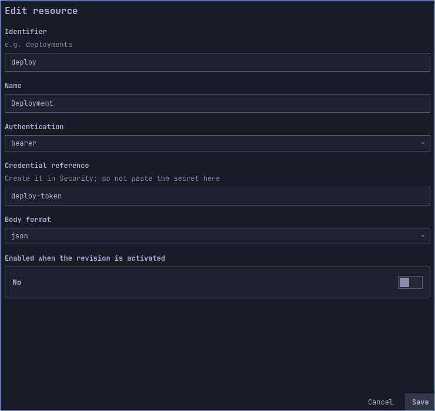
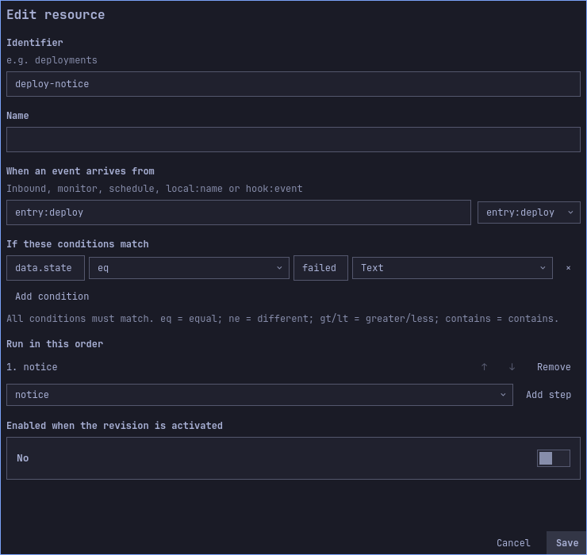
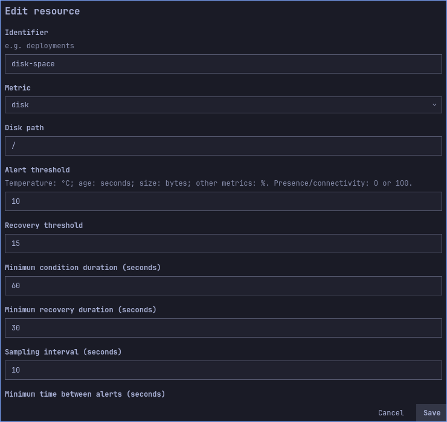
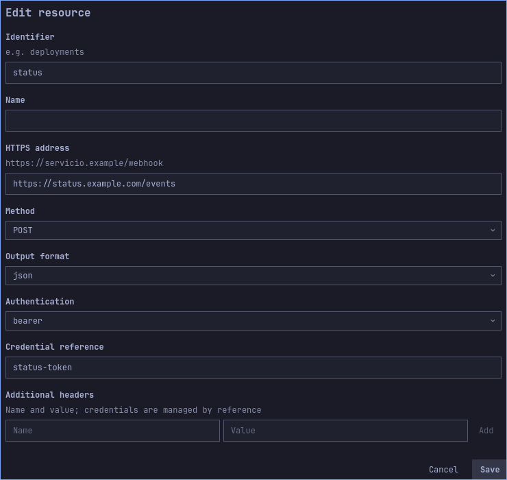
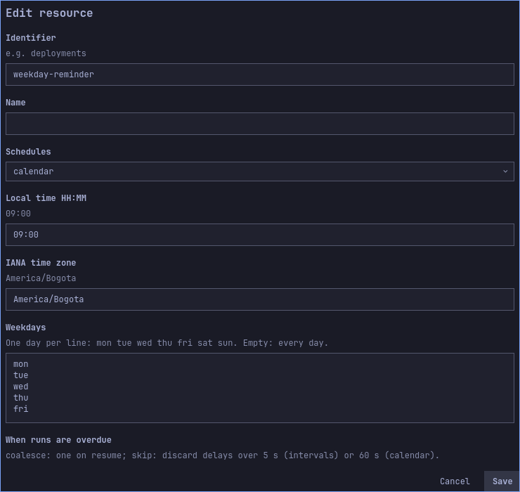
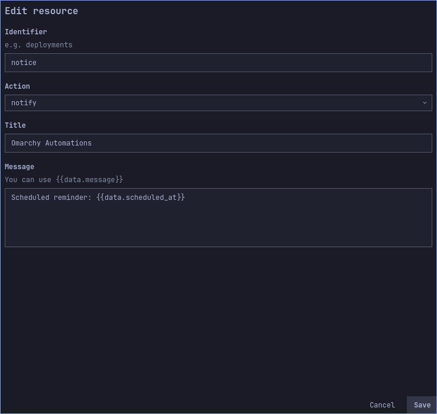

# Guided examples

[Español](../es/use-cases.md) · [User guide](user-guide.md)

| More complete examples |
|---|
| [Local code: typed script and adapter](code-examples.md) |
| [Signed GitHub provider](provider-example.md) |
| [Authorized user service](service-example.md) |
| [HTTP delivery recovery](recovery-example.md) |
| [Google OAuth](oauth-example.md) |


These examples are independent full configurations, not fragments to merge
implicitly. Importing replaces the draft, so export your current draft first.
All example sources and flows ship disabled. Import does not affect the active
revision. Enable the relevant flow to simulate; enable its source only when you
intend to activate it. Credential references are placeholders, never real secrets.


Follow the [illustrated activation steps](user-guide.md#first-automation-a-local-notification): open **Review and activate**, inspect the capabilities, click **Authorize and activate**, and wait for confirmation. Simulation creates no History entries.

## Follow one example from start to finish

1. Choose one case below. Download its linked JSON or locate it under
   `examples/use-cases/` in your checkout. Use an absolute file path when importing.
2. In the panel, choose **Export** to preserve your current draft, then **Import**
   and select the example. Import replaces the draft; it does not activate it.
3. Open the sections named in the visual walkthrough. Click **Edit** beside each
   resource ID and compare its values with the screenshots. Cancel leaves it
   unchanged; Save updates the draft. Scroll long forms to reach all fields.
4. Enable the example flow, then **Save draft**. Keep automatic sources disabled
   until you are ready to accept real events.
5. Open **Simulate / test**, enter the source, type and JSON shown in the case,
   then choose **Simulate without effects**. Compare the matched flow and resolved
   action with the expected result. Test the second input too.
6. Only when the configuration is correct, prepare credentials and external
   services, enable the intended sources, and **Review and activate**. Review the
   exact destinations, commands or services being permitted.
7. After a real event, open **History** and inspect the execution. HTTP 202 means
   the event was accepted; it does not prove its actions succeeded. Disable the
   example flow/source and activate that revision when you finish experimenting.


*Enter the source and sample JSON from the chosen case. This generic screenshot
illustrates the dialog; its sample values are not the input for every tutorial.*

| Case | Successful simulation | Check after a real event |
|---|---|---|
| Deployment failure | `failed` matches `deploy-notice`; `passed` does not | Desktop notification and completed execution |
| Disk space | Alert and recovery both resolve an outbound JSON body | Monitor transition, delivery state and receiver log |
| Weekday reminder | Timestamp is inserted into the message | Next scheduled occurrence and one notification |

### Reading the screenshots

The populated forms below are rendered from the real QML UI with the exact
public example files, using isolated profiles and the Tokyo Night theme.
`scripts/capture-tutorials.py` reproduces all 36 English/Spanish images. Sources
and flows are disabled; no credentials are loaded or effects activated. These
screenshots guide configuration and do not claim a live provider connection.

## A webhook that notifies about failures

Import [webhook-notification.json](../../examples/use-cases/webhook-notification.json)
using the panel's import control and the file's absolute path. It defines entry
`deploy`, bearer reference `deploy-token`, notification `notice` and flow
`deploy-notice` with `data.state eq "failed"`.

Enable the flow in the draft. Simulate source `entry:deploy`, type `webhook`:

```json
{"state":"failed","message":"Build failed"}
```

Expect one matching flow and notification body `Build failed`, with no effects.
Repeat with `{"state":"passed","message":"Build passed"}`: expect no match.

For a real deployment, create credential `deploy-token` in Security, enable entry
`deploy`, save, review its capability and activate. Configure the sending service
with the same bearer value and JSON format. Use a TLS proxy for remote requests
and preserve `Authorization` and the body. Its URL ends with `/hooks/deploy`.
Send the failure payload: expect HTTP 202 after persistence, then a notification
and completed History entry. Simulation does not verify bearer authentication;
only an actual HTTP request tests that boundary.

### Visual walkthrough

Connections → Inbound → Edit `deploy`: check bearer authentication and the `deploy-token` reference. Then Flows → Edit `deploy-notice`: check the source, condition and `notice` step.





The images show the imported draft before activation. Long forms scroll; fields below the visible area remain part of the configuration.

## A disk monitor with outbound alert and recovery

Import [monitor-outbound.json](../../examples/use-cases/monitor-outbound.json).
Replace `https://status.example.com/events` with your actual HTTPS receiver;
create its bearer credential under `status-token`. The example address is not a
working service. The monitor observes `/`, alerts below the low-space threshold
10 and recovers across threshold 15, with confirmation durations 60 and 30 seconds.
It samples every 10 seconds and uses a 300-second cooldown.

Enable flow `disk-report`. Simulate source `monitor:disk-space`, type `alert`:

```json
{"metric":"disk","value":8,"state":"alert"}
```

Expect the resolved JSON body `{"metric":"disk","state":"alert","value":8}`.
Repeat with type `recovered` and data
`{"metric":"disk","value":18,"state":"recovered"}`. Expect the same flow with
state `recovered` and numeric value 18. No HTTPS request occurs in simulation.

To run, enable the monitor, save and review both monitor and outbound-action
permissions before activating. Actual disk readings determine events; do not fill
your disk to test it. The simulated events above verify configuration separately
from real monitoring. Check monitor status and receiver logs when a real transition
occurs. A receiver outage creates pending/retry or failed delivery state; correct
the receiver and inspect History before manually retrying eligible HTTP steps.

### Visual walkthrough

Monitors → Edit `disk-space`: compare the thresholds and confirmation times below. Connections → Outbound → Edit `status`: replace the placeholder URL with your receiver.





The images show the imported draft before activation. Long forms scroll; fields below the visible area remain part of the configuration.

## A weekday reminder

Import [scheduled-notification.json](../../examples/use-cases/scheduled-notification.json).
It schedules 09:00 in `America/Bogota`, Monday through Friday, with `skip` for missed
occurrences. Change the timezone/time to your needs; it is not taken implicitly
from your desktop.

Enable flow `reminder`. Simulate source `timer:weekday-reminder`, type `scheduled`:

```json
{"scheduled_at":"2026-09-28T14:00:00Z"}
```

Expect `Scheduled reminder: 2026-09-28T14:00:00Z`. A second example,
`{"scheduled_at":"2026-09-29T14:00:00Z"}`, substitutes the next day's timestamp.
Simulation demonstrates the action template, not the clock scheduler.

Enable the timer, save and review timer plus notification permissions, then
activate. The scheduling view should show the next future occurrence. At that
time, expect one notification if the engine/session are available. `skip` discards
calendar occurrences over 60 seconds late; choose `coalesce` if one reminder after
an absence is preferable. Neither choice wakes a suspended machine.

### Visual walkthrough

Schedules → Edit `weekday-reminder`: set the time, timezone and weekdays. Actions → Edit `notice`: the message inserts the event timestamp.





The images show the imported draft before activation. Long forms scroll; fields below the visible area remain part of the configuration.

## Verification status

`TestDocumentedUseCases` loads the actual distributed JSON files, validates them,
checks that sources/flows ship disabled and simulates their resolved bodies with
the real engine. It checks that no grants, executions or HTTP outbox rows are
created. It covers both alert and recovery. It does not contact a real receiver,
consume a real credential or claim complete coverage of every UI option.

[More monitor variants](monitor-recipes.md): two configurations for every metric.

[Action recipes: all kinds and named command profiles](action-recipes.md).

## More schedule variants

| Kind | Example A | Example B |
|---|---|---|
| `interval` | Every 300 seconds, `coalesce` | Every 3600 seconds, `skip` |
| `calendar` | 08:30, `Europe/Madrid`, mon–fri, `skip` | 18:00, `UTC`, sat/sun, `coalesce` |

Create separate timers with these values, and a flow per source `timer:YOUR-ID`.
For the weekday example enter mon, tue, wed, thu and fri on separate lines; for
the weekend example use sat and sun. Use an empty weekday list for daily runs.
Each new interval starts counting from its first evaluation. Restarting the engine
preserves the stored due time. Calendars begin with the next future occurrence;
multiple times each day require multiple timers. A nonexistent daylight-saving
time is skipped, and a repeated hour permits only its first occurrence.

With `coalesce`, a ten-minute delay of the 300-second timer produces one event
identifying the first pending time, not two catch-up events. With `skip`, the
3600-second timer discards an occurrence more than five seconds late. Calendar
`skip` uses a sixty-second tolerance. Neither policy wakes a suspended computer.
Changing a timer's configuration resets its schedule; activating the identical
configuration retains it.

Pause with retained admission can accumulate scheduled events for later effects.
Pause with rejected admission leaves the due occurrence pending and applies the
missed policy on resumption. Revoking the timer stops new timer events, but does
not revoke action permissions for events already queued. Review History before
resuming effects. The panel shows next execution in the desktop timezone; event
`scheduled_at` is UTC and the calendar's timezone remains the one you configured.

[Payload formats and conditions](payload-recipes.md).

[Webhook authentication: HMAC, Slack, GitHub and bearer](authentication-recipes.md).
