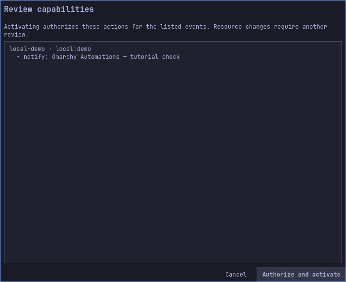

# Omarchy Automations — user guide

[Español](../es/user-guide.md) · [Project](../../README.md) · [Guided examples](use-cases.md) · [Option reference](options.md) · [Interface tour](interface.md) · [Roadmap](../../ROADMAP.md)

This guide describes the current development version. The bilingual documentation
review is recorded in the [documentation audit](../documentation-audit.md).
Release validation remains in progress; the roadmap tracks external checks and
final delivery separately. Screenshots distinguish installed-shell inspection
from light/dark development rendering.

## What the plugin does

An **event source** feeds a **flow**. All of the flow's conditions must match;
its ordered **actions** then run with the permissions you reviewed. Sources
include authenticated inbound webhooks, system monitors, schedules and local
or Omarchy hook events. Actions include notifications, outbound HTTPS requests,
user services, approved commands/scripts, adapters and selected Omarchy operations.
System services require the optional administrator broker.

The panel edits a **draft**. Saving a draft does not replace the **active
revision**. Simulation uses the draft without effects. Real events use the active
revision and its grants. Closing the panel leaves the engine running.

The product is named Omarchy Automations. Existing technical names such as
`quatrroctl`, `quatrrod.service`, `QUATRRO_PROFILE` and plugin ID
`quatrro.automations` remain for installation and data compatibility.

## Installation and first launch

For the recommended installation without Go, follow the [installation guide](installation.md). It uses `omarchy plugin add` and the prebuilt-runtime setup. The commands below describe the alternative source/archive installer; do not mix the two management modes.


If you extracted a runtime archive, the binaries are already included: skip
`make build` and run the installer from the extracted directory. Verify the
archive checksum first; see [packages](../releases.md).

For a source checkout, build with Go 1.26 or newer:

```bash
make build
```

The native interface needs Omarchy/Quickshell. Commands and scripts additionally
need a working user systemd manager and Bubblewrap; the engine checks isolation
before activation. Desktop notifications require a running notification service.

Preview the installed files in an unused temporary HOME without starting services:

```bash
python3 scripts/install.py --staging-root /tmp/omarchy-automations-preview
python3 scripts/install.py --staging-root /tmp/omarchy-automations-preview --uninstall
```

For a real installation, run from the project directory:

```bash
python3 scripts/install.py --activate
systemctl --user status quatrrod.service
quatrroctl status
```

The installer writes the binaries under `~/.local/bin`, enables the user service
and enables the plugin. Make sure `~/.local/bin` is in your terminal's PATH.
Click the connections icon in the Omarchy bar to open the panel. Its tooltip
reports connection, pause and queue state. English is the initial language;
select Español in the language control to save that preference for this profile.

For example, keep English on a shared workstation or choose Spanish for your
personal profile. Switching language does not translate resource IDs, JSON keys,
service names or your own messages.

For an isolated development profile, use these variables in **both** terminals:

```bash
export QUATRRO_PROFILE="$PWD/.dev/tutorial"
export PATH="$PWD/build:$PATH"
```

Run `quatrrod` in one terminal and `python3 scripts/run-ui.py` in the other. This
uses separate application data; any real action you explicitly activate still
has real effects. Stop this manual engine with Ctrl+C when finished.

## First automation: a local notification

1. Open **Actions**, create a `notify` action with ID `notice`, title
   `Omarchy Automations` and message `{{data.message}}`.
2. Open **Flows**, create a flow with ID `local-demo`, source `local:demo`, no
   conditions and one step, `notice`. Leave it enabled for activation.
3. Save the draft. Open **Simulate / test** with source `local:demo`, type `demo`
   and data `{"message":"Build finished"}`. Choose **Simulate without effects**.
   Expect the flow to match and the resolved notification text to appear.
4. Close the simulation results and the sample-event dialog. **Simulation only
   checks the draft: it sends no notification and creates no History entry.**
5. In the top toolbar, click **Review and activate**. This opens **Review
   capabilities**; opening this dialog alone does not activate anything.
6. Check that the dialog lists your flow (`local-demo`), source (`local:demo`)
   and the `notify` action with your notification title. Scroll through the list
   if needed. Click **Authorize and activate** to grant the listed capabilities
   and activate that revision. **Cancel** leaves the previous revision active.
   There are no individual permission checkboxes in this dialog.
7. Wait for **Revision activated. You can now run the real test from Simulate /
   test.** The status above the sections should show **Active flows: 1** when this
   is your only enabled flow. If you edit the draft later, repeat steps 5–6.



This is a real capture of the review dialog. The test profile uses the title
`Omarchy Automations — tutorial check`; your dialog displays your own title.

8. Reopen **Simulate / test**, enter source `local:demo`, type `demo` and data
   `{"message":"Build finished"}`. Click **Run real test** and confirm the
   warning. The button is unavailable when no active flow uses that source.
9. The panel opens **History** and reports **Executions created: 1**. Wait for the
   row to show **Completed** with **1 step completed**. Click **Refresh** if the
   row still shows an intermediate state, or **Details** to inspect its result.


This populated History capture comes from a real notification test, not a mockup
or an empty initial profile. `Completed` means the notification service accepted
this action; do-not-disturb mode can still hide its desktop popup.

| What you see | Meaning and next step |
|---|---|
| Simulation matches, History empty | Expected for simulation. Review, authorize and activate before a real test. |
| No active flows for this source | Save and enable the flow, check the exact source, then Review and activate. |
| No active flow matched; no executions created | The real event did not satisfy an active flow's source/conditions. Check the active revision and sample data. |
| Execution failed | Open **Details**; check the reported permission or notification-service error. |
| Execution completed, no popup | Check desktop notifications and do-not-disturb mode. |

A second real test, `{"message":"Backup checked"}`, changes the message without
changing the action. Source `local:other` should match no such flow.
The importable equivalent is [notification.json](../../examples/notification.json).
Importing disables flows; re-enable the example before reviewing and activating.

## Connections and credentials

Create credentials in **Security → Create or rotate credential**. Choose a local
reference such as `deploy-signing` or `status-api`; connection forms store that
reference, not the value. Generic values require 16–8192 bytes, without CR, LF or NUL. The
desktop store requires an available Secret Service; the explicitly selected
private file backend is **not encrypted**. There is no automatic fallback.

Reusing a reference rotates its value for subsequent requests. Deleting it makes
connections fail until an appropriate value is restored. Neither operation can
undo a request already authenticated or sent. Never put credentials in ordinary
headers, message bodies or scripts: those fields are included in configuration
exports. CLI secret operations must read their payload through `--stdin`.

### Inbound webhooks

In **Connections**, create an entry, select authentication and body format, and
reference its credential. The local endpoint is `POST
http://127.0.0.1:8791/hooks/ENTRY_ID`; check status for the actual listener.
A flow listens to `entry:ENTRY_ID`. A remote sender needs an explicitly configured
TLS proxy; the engine itself stays on loopback.

Authentication choices:

- `hmac`: generic signed requests with timestamp and delivery ID.
- `github`: GitHub's SHA256 body signature; filter authenticated body fields.
- `slack`: Slack Signing Secret with signature/timestamp verification.
- `bearer`: a shared bearer credential; use TLS for remote transport.

For example, use entry `deploy` with JSON and HMAC for a deployment system,
or entry `mentions` with Slack authentication and JSON for app mentions. Create
separate entries when the same integration needs different body formats.

JSON yields object fields such as `data.message`. Form input yields named fields;
raw input provides `data.body` and `data.content_type`. XML is normalized under
`data.xml`; multipart text is under `data.fields` and file metadata/content under
`data.files`. Uploads are stored as event data, not executed or saved as host files.
The HTTP body limit is 256 KiB; normalized XML/multipart has additional limits.

An accepted response means the event was persisted, not that its actions finished.
Slack uses HTTP 200 after persistence; ordinary entries use 202. Inspect History.

### Outbound destinations

Create an HTTPS destination first, then an `http` action referencing it. Choose
POST, PUT or PATCH; JSON, form or raw output; and no authentication, HMAC, bearer
or supported Google OAuth2. Extra headers are ordinary exported configuration.

For example, send JSON `{"message":"{{data.message}}"}` to a status receiver,
or form data `{"state":"{{type}}","source":"{{source}}"}` to a form API.
For raw output, use plain text such as `Result: {{data.message}}`.
JSON/form templates must themselves be valid JSON. Values are encoded after
substitution, so event text does not become executable template code.

Private network access is blocked unless the exact destination `host:port` is
listed in its private exceptions; examples are `status.internal:443` and
`[fd00::10]:8443`. TLS validation still applies. Redirects are not followed.

### Google OAuth2

Choose browser authorization with your own Google Desktop client, required scopes
and a local reference. Saving starts a ten-minute session; use **Open consent in
browser**, review Google's consent page, then check the connection in Security.
Alternatively, import an existing refresh token with its client credentials.
Saving credentials does not grant flow permissions.

Destinations currently allow only `www.googleapis.com` and
`calendar.googleapis.com` on HTTPS port 443 for this authentication mode. A real
Google account end-to-end test remains pending; fixture tests do not establish
compatibility with every Google API. Local deletion does not revoke Google consent.

## Actions and flows

| Action | How to use it | Two examples |
|---|---|---|
| `notify` | Set title and message; event placeholders are supported. | Build completed; disk space recovered. |
| `http` | Select a registered destination and a body template. | Report a monitor alert; send a deployment result. |
| `service` | Set an exact user `.service` and status/start/stop/restart. | Read `backup.service` status; restart your `worker.service`. |
| `omarchy` | Select an offered operation. | `theme.current` reads the theme; `system.lock` locks the session. |
| `command` | Select a fixed executable/arguments or a directory profile. | `/usr/bin/true` as a minimal check; `file-exists` on an approved mount. |
| `script` | Prepare code and typed parameters, then select its exact revision. | Validate a project name; process a bounded integer count. |
| `adapter` | Prepare the local adapter, then select its revision. | Normalize event fields; calculate data for a later notification. |
| `system-service` | Requires administrator policy and broker authorization. | Read an allowed system service; restart one explicitly allowed service. |

Fixed command arguments use one argument per line, without shell expansion.
Commands/scripts have no IP network and no home access by default. Authorized
directories expose a whole selected tree: read-only for inspection, read/write
for changes. Prepare the directory identity, select a sandbox target such as
`/work/data`, and review the resulting permission. Preparation alone grants nothing.

For scripts, choose Bash or Python, specify ordered string/integer/boolean
parameters, and prepare the code. In its action select **Use this revision and
reset parameters**, then supply each literal or event field. For example, bind a
bounded string `message` to `data.message`, or set an integer `count` literally to
`3`. Changing code or its parameter contract requires a new revision and review.
Adapters transform event data; they are not executed during simulation.

A flow's source must match exactly. All conditions must pass. Operators are `eq`,
`ne`, `gt`, `lt` and string `contains`; select the correct text/number/boolean type.
For example, `data.state eq "failed"` selects failures, while `data.percent gt 90`
selects a numeric threshold. Missing fields do not match, even for `ne`.
Steps run in the listed order. An adapter may produce fields for following steps.

[Omarchy hooks and optional administration](system-integration.md) explains hook installation, two event examples and the administrative broker lifecycle.

## Monitors and schedules

A monitor emits `alert` and `recovered` events from `monitor:ID`; journal monitors
emit `journal`. Create flows for that source and, if needed, condition on `type`.
For example, use one notification flow for `type eq alert` and an outbound
recovery flow for `type eq recovered`.

CPU and memory measure used percent. Disk and battery measure available percent.
CPU, memory, file age/size and temperature alert when rising; disk, battery and
presence/connectivity metrics alert when falling. Set a distinct recovery
threshold to prevent repeated changes around one value.

Examples: disk threshold 10/recovery 15 detects low free space; CPU threshold
90/recovery 75 detects sustained high usage. Set confirmation duration, recovery
duration, sampling interval and cooldown to suit the signal. An unavailable
reading is not treated as zero. Monitors are not real-time checks.

Other metrics cover a user service, your process executable, file existence/age/
size, a temperature sensor, HTTPS HEAD connectivity and a user unit's journal
priority. File monitors inspect metadata only and reject symlinks. Journal events
do not include message text. Resetting a journal cursor starts fresh and does not
recover old entries.

Schedules emit `scheduled` from `timer:ID`. Intervals accept 5 seconds to 365 days.
Calendars use HH:MM, an explicit IANA timezone and optional weekday codes. For
example, run every 300 seconds, or at 09:00 in `America/Bogota` on `mon`–`fri`.
An empty weekday list means every day; create separate schedules for multiple times.

`coalesce` emits one event after missed occurrences. `skip` discards occurrences
more than 5 seconds late for intervals or 60 seconds for calendars. The engine
does not wake a suspended computer. Paused effects and missed scheduling are
separate controls; inspect the next occurrence in the scheduling view.

## Operation, recovery and data

**Pause** retains incoming events but stops dispatching subsequent work. **Resume**
continues it. **Stop executions** asks for confirmation, cancels queued work and
attempts to stop active processes. Cancellation cannot undo external effects.

In History, use the pending/uncertain queue filter, page through results and open
Details. A completed step may belong to a still-pending execution. A `denied` step
needs an appropriate reviewed grant; an `uncertain` result needs inspection of the
actual external effect before deciding what to do.

For failed/cancelled HTTP steps, correct the receiver and choose **Retry HTTP**.
Confirmation reuses the original body and idempotency key. Automatic retry can
occur for transport errors, 408, 429 and 5xx, up to eight attempts or 24 hours.
The receiver must implement idempotency to avoid duplicate effects. For example,
repair an unavailable receiver before retrying, or restore a deleted credential
before a pending automatic attempt. Commands/scripts are not automatically retried.

Security shows active permissions and offers revocation. Revoking an action
prevents future dispatch under that grant; it does not undo completed actions.
Revoking a timer/monitor stops its new events, not the independent action grants
of work already queued.

Default storage limits are 10,000 events, 64 MiB of payload, 7 days of terminal
history and 30 days of deduplication. Pending/uncertain work is retained. Reaching
a quota rejects new events instead of deleting unfinished work. For example,
inspect pending deliveries before increasing limits, or export a diagnosis when
new events fail without an obvious configuration error.

Import reads a local JSON file into the draft and disables entries, flows,
monitors and schedules. It neither replaces the active revision nor grants
permissions. Export writes a **new absolute `.json` path**, never overwriting it;
credential values are excluded, but your ordinary configuration text is included.
Diagnostic export contains versions, counts and operational state rather than
configuration, URLs, payloads or credential values. Neither export is uploaded.

## Updating, uninstalling and troubleshooting

Before an update, inspect pending/running/uncertain work and stop the engine.
Build the new source, then reinstall its matching engine, CLI and UI together:

```bash
systemctl --user stop quatrrod.service
python3 scripts/install.py --activate
```

The installer refuses foreign or modified owned files and records a backup path.
Keep that backup private. Data restoration requires the engine stopped and uses
`python3 scripts/install.py --restore-data /ABSOLUTE/BACKUP/PATH`; restored data
starts paused, with admission rejected and grants removed. Review before resuming.
It does not restore credential values or downgrade binaries.

To uninstall, run `python3 scripts/install.py --uninstall`. It disables the engine
and plugin and removes verified owned files; application data, credentials and
backups are retained.


Hooks installed separately with `omarchy hook install` are not owned by the plugin
installer and remain in place. Review and remove only your automation hook if you
no longer need it; see [system integration](system-integration.md). Other plugins,
hooks and shell preferences are preserved. The optional administrative broker has
its own removal procedure in that guide.

If stopping the service or disabling the widget fails, uninstallation stops before
removing owned files. The engine may already be stopped: resolve the reported
error before retrying, or restart it with `systemctl --user start quatrrod.service`
if you intend to keep using the installation. A missing receipt or modified owned
file requires investigation; do not bypass ownership checks or recursively delete
the plugin directory.

| Symptom | Check |
|---|---|
| Disconnected panel | `systemctl --user status quatrrod.service`, then `quatrroctl status`; confirm the same profile. |
| Incompatible components | Rebuild/reinstall the engine, CLI and UI together; keep application data. |
| Simulation matches, real event does nothing | Active revision, enabled resources, pause state, grants and History. |
| No desktop notification | Notification service/session availability and do-not-disturb settings. |
| Inbound denied | Credential reference, exact original body/signature, timestamp and configured format. |
| Outbound denied or failed | HTTPS/TLS, exact private exception, credential state and attempt details. |
| Command activation fails | User systemd/Bubblewrap availability and required isolation support. |
| Import fails | Absolute regular JSON file, supported schema, size and validation errors. |

## Glossary and publication

**Draft**: editable configuration. **Revision**: a fixed activated configuration.
**Grant**: permission tied to exact reviewed resources. **Entry**: inbound endpoint.
**Destination**: registered outbound HTTPS address. **Outbox**: persisted delivery
body and retry state. **Uncertain**: an effect may have happened without a confirmed
stored result. **Credential reference**: a local identifier, never the secret itself.

The intended repository is `PuroDelphi/omarchy-automations`. Login on this machine
uses the prepared GitHub CLI; it does not publish files:

```bash
/home/macondo/Work/.quatrro-tools/github-cli/gh auth login --hostname github.com --git-protocol https --web
/home/macondo/Work/.quatrro-tools/github-cli/gh auth setup-git --hostname github.com
```

Authenticate in the browser; do not paste tokens into chat. Publication still
requires final validation, file review, your chosen Git author identity and an
inspection of existing remote history. No force push is part of initial setup.

[Full first-publication procedure](github.md): login, author identity, first commit, existing remote history and push verification.

[Measured resources and admission limits](performance.md) documents the installed idle/load test and its scope.

[Security boundaries and verification](security.md) explains the threat model, checks and remaining integration limits.
