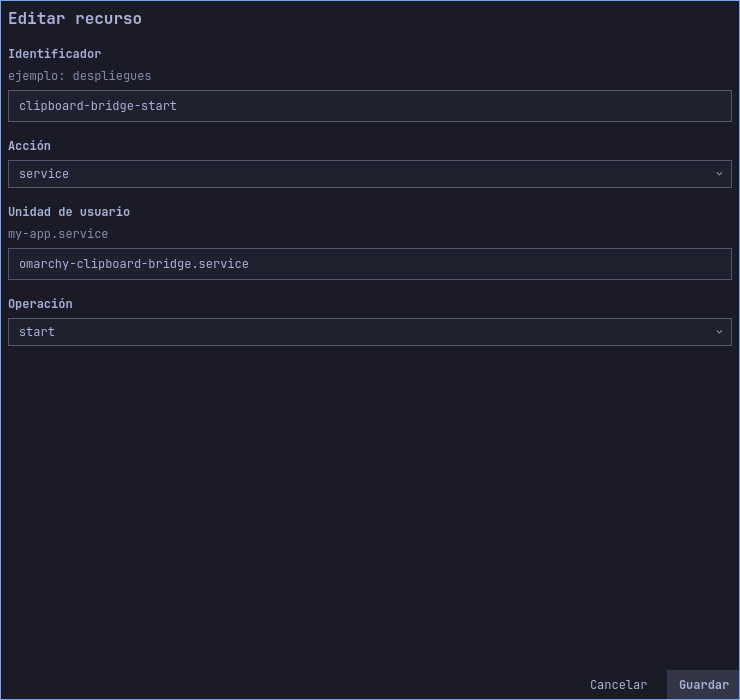
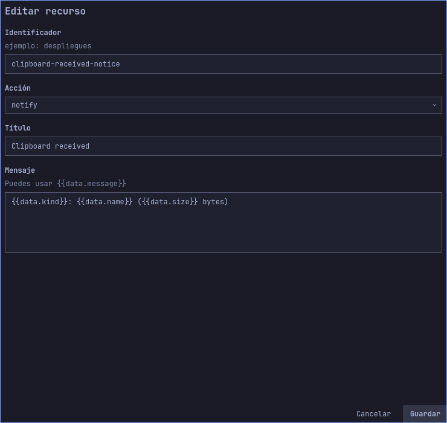
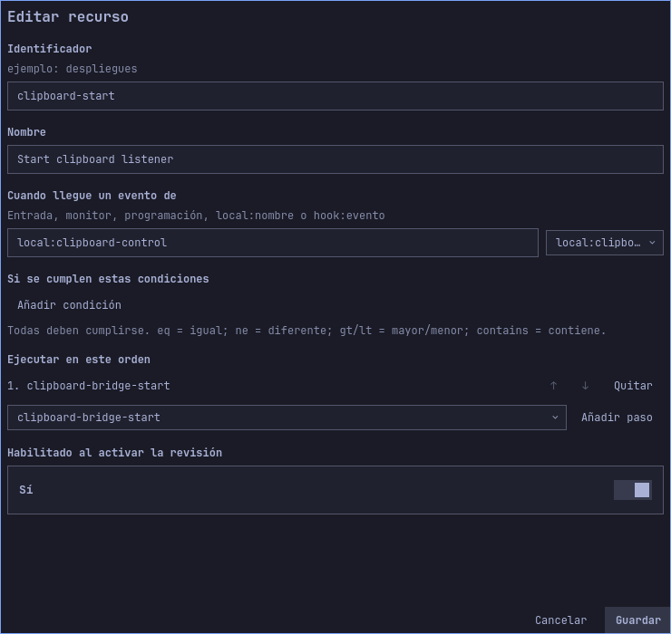
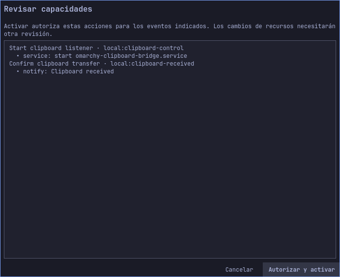
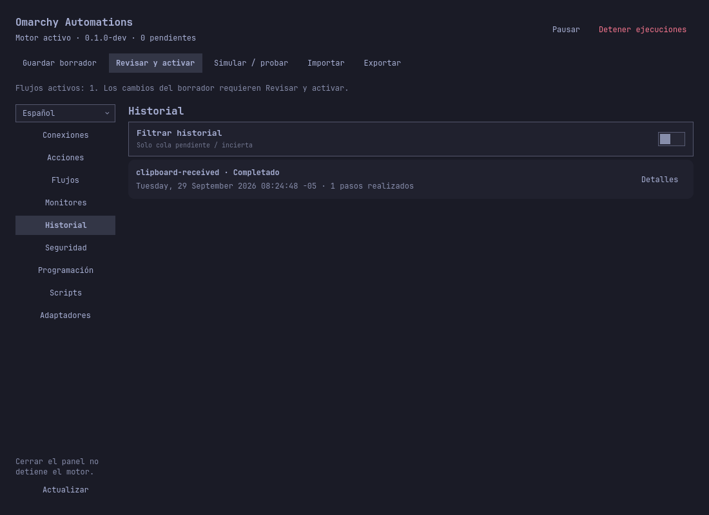

# Guía avanzada: enviar texto y archivos al portapapeles

[English](../en/clipboard-bridge.md) · [Guía de uso](user-guide.md) · [Seguridad](security.md)

**Resultado:** una segunda computadora envía texto o archivos a Omarchy mediante
un túnel SSH. El texto llega al portapapeles Wayland. Los archivos se guardan en
`~/Downloads/ClipboardInbox` y el portapapeles recibe una URI del archivo.
Omarchy Automations inicia el servicio bajo petición y registra cada recepción
correcta con una notificación y una ejecución en Historial.

Este ejemplo usa un **servicio auxiliar**. El plugin actual limita el cuerpo de
sus webhooks a 256 KiB y cada archivo multipart a 64 KiB. Además, las acciones
aisladas no pueden acceder al socket Wayland ni guardan adjuntos como archivos
del host. El auxiliar recibe los bytes; el plugin controla su unidad de usuario
y procesa sus eventos. El límite del ejemplo es **32 MiB por transferencia**.
Los archivos se comparten como `text/uri-list`: algunas aplicaciones no aceptan
ese formato y habrá que abrir la carpeta de recepción. Se envían elementos al
receptor; no hay sincronización continua ni acceso remoto de lectura.

## 1. Instala el auxiliar en el equipo receptor

Primero [instala Omarchy Automations](installation.md). Necesitas Python 3,
`wl-copy`, systemd de usuario y una sesión Wayland activa. Usa tu cuenta de
escritorio. Los comandos crean únicamente el script, la unidad y un token privados
para este ejemplo:

```bash
plugin="$HOME/.config/omarchy/plugins/quatrro.automations"
mkdir -p "$HOME/.local/libexec/omarchy-automations" "$HOME/.config/systemd/user"
install -m 700 "$plugin/examples/clipboard-bridge/clipboard_bridge.py" \
  "$HOME/.local/libexec/omarchy-automations/clipboard_bridge.py"
install -m 600 "$plugin/examples/clipboard-bridge/omarchy-clipboard-bridge.service" \
  "$HOME/.config/systemd/user/omarchy-clipboard-bridge.service"
python3 "$HOME/.local/libexec/omarchy-automations/clipboard_bridge.py" init
systemctl --user import-environment WAYLAND_DISPLAY XDG_RUNTIME_DIR
systemctl --user daemon-reload
```

`init` no sobrescribe un token existente. El servicio escucha únicamente en
`127.0.0.1:8786` y **no se habilita al iniciar sesión**. Revisa
`systemctl --user show-environment`: el administrador de usuario debe conocer
`WAYLAND_DISPLAY`. Si cambias de sesión, vuelve a importar esa variable cuando
sea necesario. No publiques el puerto 8786 directamente en la red: el emisor
utilizará SSH y el token.

## 2. Configura las acciones en el panel

En **Acciones**, crea `clipboard-bridge-start` de tipo `service`, unidad
`omarchy-clipboard-bridge.service`, operación `start`. Esta acción inicia la
unidad instalada; no la habilita en cada inicio de sesión.



Crea `clipboard-received-notice` de tipo `notify`, título `Clipboard received`
y mensaje `{{data.kind}}: {{data.name}} ({{data.size}} bytes)`. La notificación
muestra metadatos, nunca el contenido enviado.



## 3. Configura los flujos y simula

En **Flujos**, crea `clipboard-start` con origen `local:clipboard-control`,
habilitado y paso `clipboard-bridge-start`. Este evento local iniciará el
receptor.



Crea `clipboard-received` con origen `local:clipboard-received`, habilitado y
paso `clipboard-received-notice`. El auxiliar envía ese evento cuando `wl-copy`
finaliza correctamente. Respeta los identificadores: el origen que emite el
auxiliar es fijo.


Guarda el borrador. En **Simular / probar**, usa origen
`local:clipboard-control`, tipo `start` y datos `{}`: debe coincidir el paso
del servicio, **sin iniciarlo**. Simula después `local:clipboard-received`, tipo
`file` y datos `{"kind":"file","name":"report.pdf","size":4096}`. Debe
resolverse el texto de la notificación. Simular no modifica el portapapeles ni
crea entradas en Historial.

Si ya tienes automatizaciones, añade estos cuatro recursos al borrador existente.
El archivo [automation.json](../../examples/clipboard-bridge/automation.json)
sirve para un perfil temporal o vacío: **importar reemplaza todo el borrador** y
deja deshabilitados ambos flujos. Habilítalos antes de revisar.

## 4. Revisa los permisos y activa

Pulsa **Revisar y activar**. Comprueba que el diálogo lista la acción `start`
para la unidad exacta bajo `local:clipboard-control` y la notificación bajo
`local:clipboard-received`. Pulsa **Autorizar y activar**. Guardar y simular
no activan nada.



Las capturas muestran un borrador con ambos flujos habilitados y su revisión en
un perfil aislado. No se inició el receptor para obtenerlas.

## 5. Inicia el receptor con Omarchy Automations

El siguiente evento **sí es real**: iniciará el servicio porque el flujo está
activo. Ejecútalo en el equipo receptor:

```bash
quatrroctl emit --stdin <<'JSON'
{"source":"local:clipboard-control","type":"start","data":{}}
JSON
systemctl --user status omarchy-clipboard-bridge.service
```

Espera a que la unidad esté activa y a que
`journalctl --user -u omarchy-clipboard-bridge.service -n 20` muestre
`Clipboard bridge listening on 127.0.0.1:8786`. Historial debe mostrar
`clipboard-start` como completado. Si falla, abre **Detalles** y comprueba el
nombre de la unidad, `WAYLAND_DISPLAY` y el modo 0600 del token.

## 6. Envía texto y un archivo desde otra computadora

En la **emisora**, abre este túnel SSH al receptor. Sustituye `user@receiver`
por tu cuenta y host SSH y deja la terminal abierta:

```bash
ssh -o ExitOnForwardFailure=yes -N -L 8786:127.0.0.1:8786 user@receiver
```

En otra terminal, copia el cliente y el token por SSH. El token es una
credencial; mantén privado el directorio que lo contiene:

```bash
mkdir -p "$HOME/.config/omarchy-automations"
chmod 700 "$HOME/.config/omarchy-automations"
scp user@receiver:~/.local/libexec/omarchy-automations/clipboard_bridge.py ./clipboard_bridge.py
scp user@receiver:~/.config/omarchy-automations/clipboard-bridge.token \
  "$HOME/.config/omarchy-automations/clipboard-bridge.token"
chmod 600 "$HOME/.config/omarchy-automations/clipboard-bridge.token"
```

Envía el texto actual del portapapeles emisor. También puedes usar `printf` en
lugar de `wl-paste`:

```bash
wl-paste --no-newline | python3 ./clipboard_bridge.py send-text \
  --token-file "$HOME/.config/omarchy-automations/clipboard-bridge.token"
```

Envía un **archivo regular, incluso binario, de hasta 32 MiB**:

```bash
python3 ./clipboard_bridge.py send-file "$HOME/Pictures/example.png" \
  --token-file "$HOME/.config/omarchy-automations/clipboard-bridge.token"
```

La respuesta debe contener `"accepted": true` y
`"automation_event_sent": true`. Este último campo confirma que el auxiliar
entregó el evento al motor; comprueba su ejecución completada en Historial. Si
es `false`, **el portapapeles ya cambió**, pero falló el envío al motor: revisa
`quatrrod.service` y comprueba el portapapeles o la carpeta antes de reenviar.

Un archivo aparece en `~/Downloads/ClipboardInbox` con un prefijo único. Se
puede pegar en un gestor de archivos compatible; de lo contrario, abre la
carpeta. Enviar texto sustituye el texto del portapapeles receptor. El emisor
no puede leer remotamente el portapapeles ni los archivos del receptor.



La captura procede de un perfil privado con un sustituto del comando de
notificación, para no afectar el escritorio del autor. El motor real activó el
flujo de recepción y completó la ejecución. Una prueba de extremo a extremo
con el motor real y sustitutos de Wayland y notificaciones produjo dos ejecuciones
completadas para texto y archivo. El intercambio entre dos escritorios físicos
y el pegado en cada aplicación necesitan una prueba propia.

## Problemas frecuentes y apagado

| Síntoma | Comprueba |
|---|---|
| `connection refused` | Túnel SSH, puerto 8786 y estado de la unidad. |
| `401 unauthorized` | Que el token sea del receptor correcto y siga privado. |
| `413` | Límite de 32 MiB; usa otro método para archivos grandes. |
| `503 clipboard unavailable` | Sesión Wayland, `WAYLAND_DISPLAY` y diario de la unidad. |
| HTTP aceptado sin entrada en Historial | `automation_event_sent`, flujo activo, permiso y motor. |
| Archivo recibido que no se puede pegar | La aplicación quizá no acepta `text/uri-list`; abre la carpeta. |

Detén solo esta unidad al terminar. Deshabilitar el flujo no detiene un servicio
que ya está funcionando:

```bash
systemctl --user stop omarchy-clipboard-bridge.service
```

Elimina la copia del token del emisor si ya no la necesitas. Para retirar todo
el ejemplo, detén el servicio, quita su script y unidad dedicados, ejecuta
`systemctl --user daemon-reload` y borra su token y carpeta únicamente después
de comprobar si contienen archivos que quieras conservar. Retira o deshabilita
las acciones y flujos correspondientes en el borrador y activa esa revisión.
