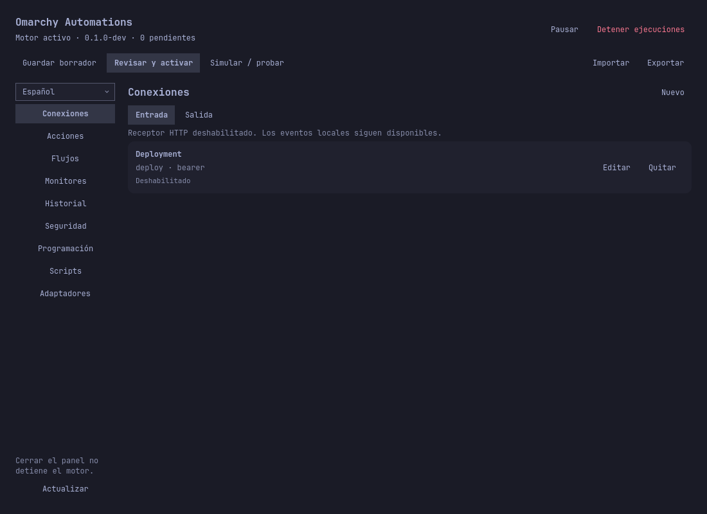

# Instalar, actualizar y retirar

[English](../en/installation.md) · [Guía de usuario](user-guide.md)

## Recomendado: plugin Omarchy y motor precompilado

Necesitas Linux amd64, el comando de plugins de Omarchy Quattro y Python 3.
Comandos/scripts requieren Bubblewrap; las notificaciones, el servicio del
escritorio. Esta instalación no requiere Go. Ejecútala como usuario normal, no root.

```bash
omarchy plugin add https://github.com/PuroDelphi/omarchy-automations.git --yes
python3 ~/.config/omarchy/plugins/quatrro.automations/scripts/setup.py
```

El primer comando clona código de confianza sin habilitarlo. Setup descarga la
versión preliminar específica seleccionada en `scripts/setup.py`, valida SHA256
del archivo y hashes de cada fichero, comprueba compatibilidad de UI, instala
`quatrrod` y `quatrroctl` en `~/.local/bin`, habilita el servicio y el widget.
No instala el broker privilegiado opcional. Los hashes detectan corrupción;
no son una firma independiente del publicador. Descarga únicamente de las
[versiones de este repositorio](https://github.com/PuroDelphi/omarchy-automations/releases).

Pulsa el icono de conexiones en la barra. Inglés es el idioma inicial; selecciona
español en la barra lateral para conservar esa preferencia.



*La captura contiene una entrada de tutorial deshabilitada. Una instalación nueva
no tiene automatizaciones; importar un ejemplo rellena el borrador.*

Comprueba `systemctl --user status quatrrod.service` y `~/.local/bin/quatrroctl status`.
Mantén `~/.local/bin` en el PATH del escritorio para que el panel gestionado por Git
encuentre la CLI.

## Actualizar

Revisa primero el trabajo pendiente en Historial. Desde la sesión de escritorio:

```bash
omarchy plugin update quatrro.automations
python3 ~/.config/omarchy/plugins/quatrro.automations/scripts/setup.py --update
```

El checkout selecciona una versión correspondiente. Setup rechaza archivos del
panel incompatibles y archivos propios modificados. Tras las comprobaciones,
detiene el motor, instala el runtime y vuelve a iniciarlo/habilitarlo. Si falla
tras detenerlo, revisa el error antes de arrancar con
`systemctl --user start quatrrod.service`. Los backups quedan privados junto al
recibo de instalación. No se suben fuentes ni secretos. Actualizar solo el checkout
Omarchy no actualiza el motor.

## Retirar

```bash
python3 ~/.config/omarchy/plugins/quatrro.automations/scripts/setup.py --uninstall
omarchy plugin remove quatrro.automations
```

Ejecuta los comandos en ese orden. El desinstalador detiene/deshabilita el motor,
deshabilita el widget y retira solo archivos de runtime verificados. Omarchy retira
su checkout; inspecciona cambios locales antes de confirmar. Datos, credenciales
y backups se conservan. Hooks separados y broker administrativo tienen
[pasos propios de retirada](system-integration.md).

## Instalación sin conexión y vista previa

Descarga `.tar.gz` y el `.tar.gz.sha256` adyacente de la misma versión en un equipo
con conexión. Conserva sus nombres y copia ambos al destino. Desde el checkout,
usa una ruta absoluta:

```bash
python3 scripts/setup.py --archive /absolute/path/omarchy-automations-0.1.0-dev-linux-amd64.tar.gz
```

Para un HOME desechable que nunca activa servicios:

```bash
python3 scripts/setup.py --archive /absolute/path/omarchy-automations-0.1.0-dev-linux-amd64.tar.gz --staging-root /tmp/automations-preview
python3 scripts/setup.py --staging-root /tmp/automations-preview --uninstall
```

Un checkout fuera del directorio de plugins usa una UI gestionada por el instalador.
Un checkout dentro del directorio estándar de plugins conserva la UI bajo Git.
Cambiar de modo requiere desinstalar el anterior; setup nunca adopta ni elimina
un checkout ajeno existente.

## Instalaciones anteriores y compilación propia

Si usaste `scripts/install.py`, actualiza desde el checkout original con
`python3 scripts/setup.py --update` y desinstala desde allí con
`python3 scripts/setup.py --uninstall`. No ejecutes `omarchy plugin add` encima.

Para cambios no publicados o desarrollo, consulta [Desarrollo y compilación](development.md).
Solo están verificados los paquetes precompilados para Linux amd64.

## Problemas frecuentes de instalación

| Mensaje o síntoma | Siguiente paso |
|---|---|
| ID del plugin ya instalado | Usa el modo de gestión existente; actualiza en lugar de duplicarlo. |
| Git plugin differs from runtime package | Usa el checkout de esa versión o compila tus cambios. No sobrescribas ediciones locales. |
| Checksum mismatch | Descarga ambos archivos de la misma versión oficial. No omitas la verificación. |
| Dependencia ausente | Instala la dependencia indicada con las herramientas habituales de Omarchy y reintenta. |
| Motor activo | Revisa Historial y usa `--update`, que lo detiene antes de sustituirlo. |
| Recibo ausente o archivo propio modificado | Inspecciona la instalación; los controles de propiedad bloquean sustitución/retirada deliberadamente. |
| Descarga no disponible | Comprueba conexión y versión; usa archivo offline o compilación desde fuentes. |

CI verifica motor portable, instalador, documentación y paquete. No sustituye
las pruebas nativas de Omarchy ni las pruebas Google/sesión aplazadas.

Los asistentes de IA pueden usar la [skill Omarchy Automations incluida](ai-assistants.md), sin Go ni código fuente.
