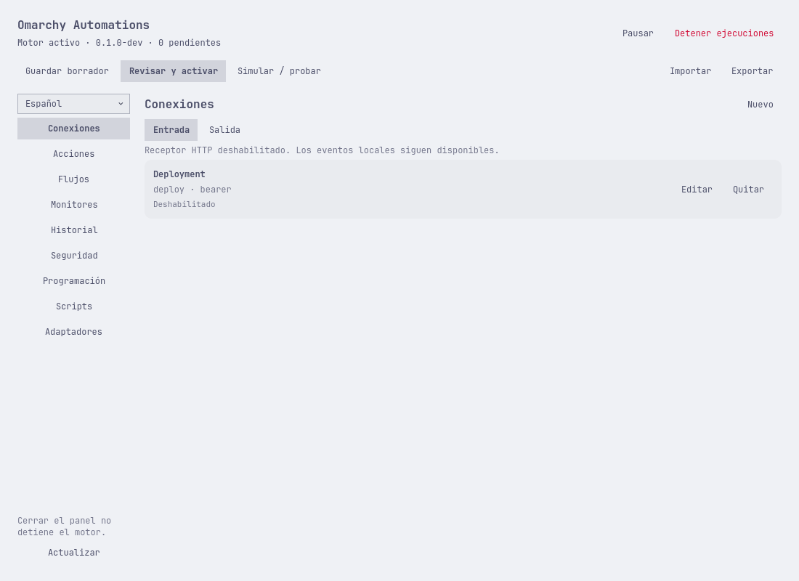
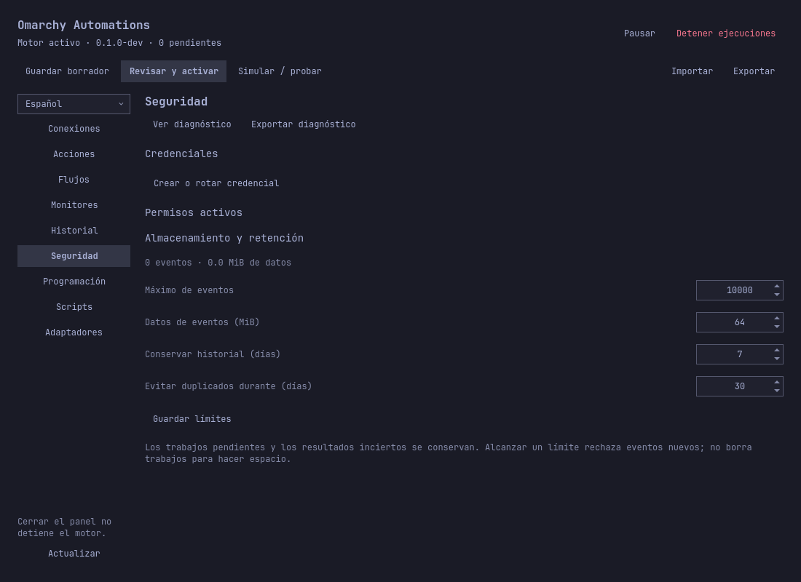
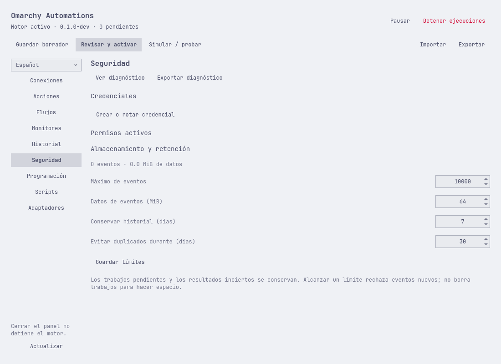
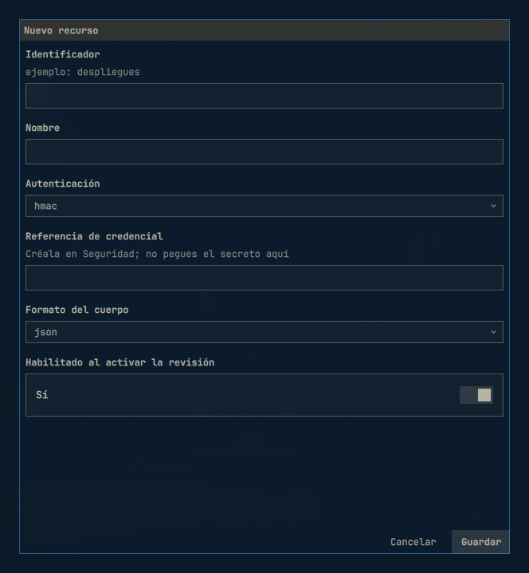
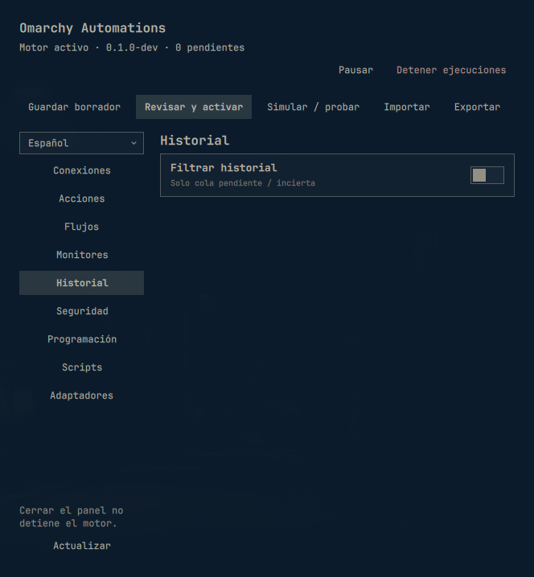
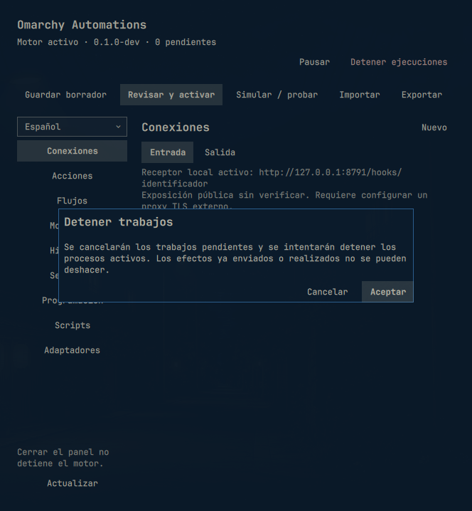
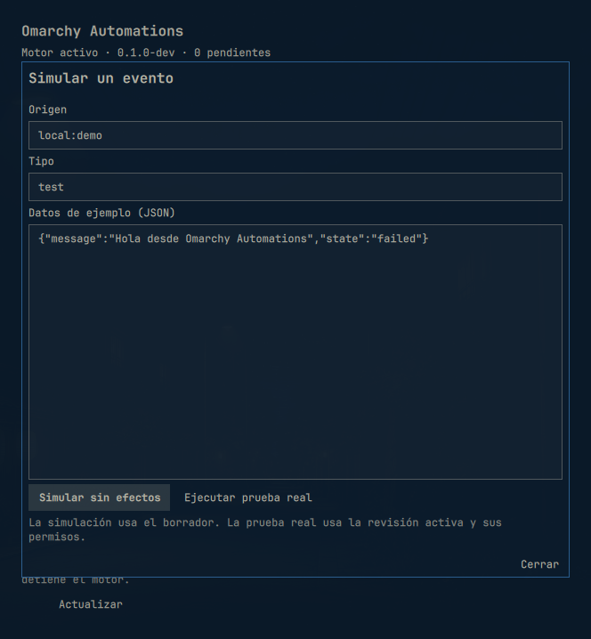
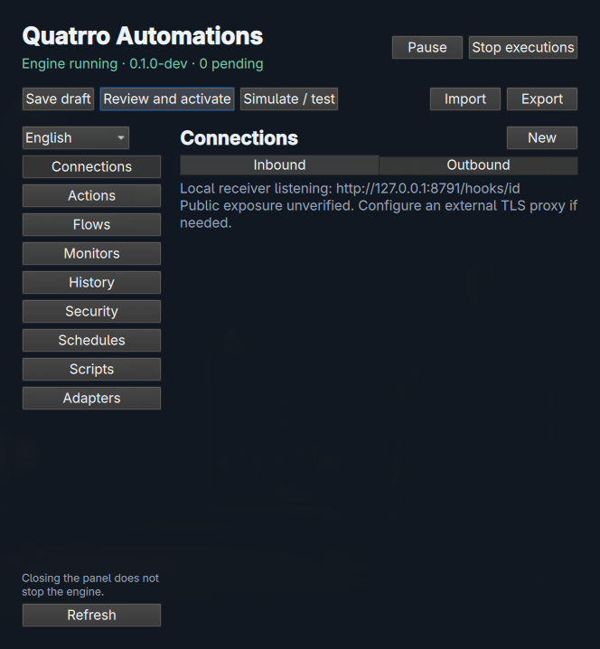
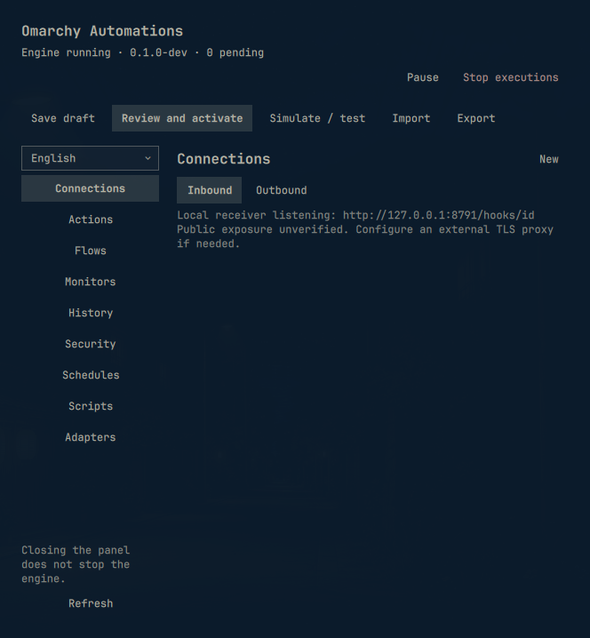

# Recorrido por la interfaz

[English](../en/interface.md) · [Guía de usuario](user-guide.md) · [Todas las opciones](options.md)

Estas capturas muestran el panel de desarrollo con controles reales de Omarchy y
los temas instalados Tokyo Night (oscuro) y Catppuccin Latte (claro). Inglés es el
idioma predeterminado; el selector lateral conserva tu elección de inglés o
español. Los nombres de recursos y datos de eventos son contenido del usuario y
no se traducen.

## Conexiones

Elige **Entrada** para configurar receptores o **Salida** para configurar destinos
HTTPS. **Nuevo**, **Editar** y **Quitar** modifican el borrador. **Guardar borrador**
lo conserva; **Revisar y activar** muestra los permisos antes de aplicarlo.
Por ejemplo, crea un receptor de fallos de despliegue o registra un destino para
alertas de disco. Los [ejemplos guiados](use-cases.md) explican ambas configuraciones.

La captura contiene el ejemplo `Deployment` deshabilitado. El receptor HTTP está
deshabilitado en el entorno de captura; ese mensaje describe el listener, no la
entrada individual. Una instalación normal muestra su listener configurado.

El plugin hereda colores, tipografía y controles del tema. No tiene un selector
de tema independiente. Cambiar el tema de Omarchy cambia su apariencia.

## Seguridad

Usa **Crear o rotar credencial** para guardar un secreto localmente. Los permisos
otorgados aparecen en **Permisos activos** tras activar. En este perfil vacío no
hay credenciales ni permisos que mostrar.

Los cuatro campos numéricos controlan cantidad de eventos, tamaño de datos,
retención de historial terminal y deduplicación. Edita un valor directamente o
usa sus flechas y pulsa **Guardar límites**. A diferencia de guardar un borrador,
esto se aplica inmediatamente. Por ejemplo, conserva historial terminal durante
14 días manteniendo deduplicación en 30 días, o aumenta el máximo a 20000 eventos
después de investigar una cola llena. Consulta las [opciones de almacenamiento](options.md#storage.max_events)
para conocer valores admitidos y efectos.

## Formulario de entrada en el shell del escritorio

Esta captura adicional procede del plugin instalado en el shell real del
escritorio a 664 × 718, con el tema activo. Se llegó a **Nuevo** mediante Tab y
se abrió con Enter. Se revisó el formulario en ambos idiomas y se cerró con
Escape sin guardar; se restauró inglés. Campos, selectores nativos y botones
Cancelar/Guardar permanecen dentro de la ventana. Comprueba el formulario de
entrada; la matriz de 48 layouts de desarrollo cubre los demás por separado.
No se creó entrada, credencial ni automatización para esta captura.

## Procedencia y límites de las capturas

Las ocho imágenes en inglés/español se generaron con `scripts/capture-docs.py`
desde el panel QML real a 1100 × 800, con renderizado fuera de pantalla, un motor
y perfil temporales y el ejemplo de webhook distribuido. No se activaron flujos,
no se cargaron valores secretos, HTTP entrante estaba deshabilitado y no se cambió
el tema del escritorio. Se comprueba que los campos de Seguridad queden dentro
de la ventana en cada idioma y tema. Son capturas para documentación, no prueba
de todos los diálogos, ventanas pequeñas, lector de pantalla o sesión real de
escritorio. Su generación y revisión constan en el [registro de validación](../validation.md).

## Ventanas pequeñas y navegación

En una ventana estrecha, el encabezado y la barra de acciones usan filas adicionales
para mantener visibles los botones. Historial sitúa la descripción del filtro
encima de la paginación. Si la barra lateral supera el espacio disponible,
desplázala para llegar a sus últimos controles. Al mover el foco del teclado a
un control lateral, este se desplaza hasta quedar visible, incluidos el selector
de idioma y Actualizar.

Esta captura del compositor muestra el panel actualizado instalado a 664 × 718.
Se abrió Historial con Tab/Shift-Tab y Return; se inspeccionaron ambos idiomas,
después se restauró inglés y se cerró el panel. La descripción del filtro y las
acciones superiores caben. No se activaron flujos ni generaron eventos para estas
capturas.

## Diálogos instalados

Estas capturas del compositor muestran encabezado nativo, advertencias y pie
en el shell instalado. Se abrieron ambos diálogos con teclado y se descartaron
con Escape. No se enviaron órdenes de detener, simulaciones ni eventos reales.
Después se restauró inglés. Las capturas de desarrollo claras/oscuras comprueban
por separado los colores del encabezado y 120 disposiciones de diálogos.

## Comparación del aspecto nativo

La captura histórica muestra el nombre anterior y los botones genéricos. Se
conserva únicamente para documentar el rediseño solicitado. El panel instalado
usa controles nativos y el nombre Omarchy Automations.

El icono de automatización es el primero del recorte de la barra. Su celda
nativa de 27 × 26 coincide con los iconos vecinos. Usa fuente y tamaño del shell;
los estados desconectado, pausado y fallido tienen glifos distintos y tooltip
traducido.
