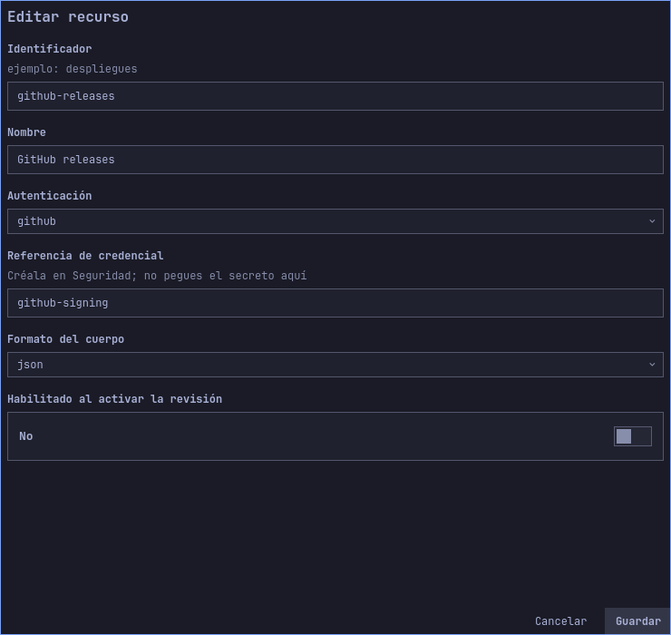
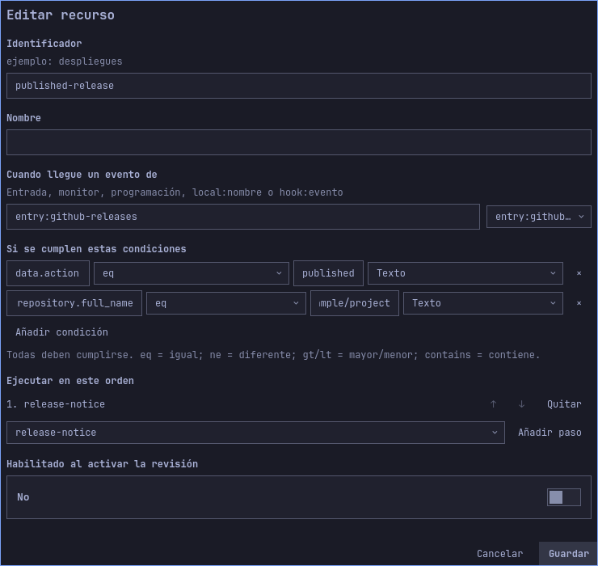

# Ejemplo de proveedor firmado: releases de GitHub

[English](../en/provider-example.md) · [Guía de usuario](user-guide.md) · [Otros ejemplos](use-cases.md)

Este ejemplo notifica al publicar una release en un repositorio elegido. No publica
releases ni sube tu proyecto a GitHub. Una fixture local permite verificar el plugin
sin cuenta; la integración real también necesita administrar webhooks del repositorio
y un receptor HTTPS accesible.

## Configurar y simular

1. Exporta el borrador que quieras conservar e importa
   [github-release.json](../../examples/use-cases/github-release.json).
2. En `published-release`, cambia condición de repositorio `example/project` por
   el `propietario/nombre` exacto, por ejemplo `PuroDelphi/omarchy-automations`.
   Conserva `data.action eq published`.
3. Habilita ese flujo y guarda. En Simular / probar elige origen
   `entry:github-releases`, tipo `webhook` y este cuerpo ilustrativo (usa el nombre
   de repositorio elegido en paso 2):

   ```json
   {
     "action": "published",
     "repository": {"full_name": "example/project"},
     "release": {"tag_name": "v1.2.0"}
   }
   ```

   Debe coincidir un flujo y resolver `example/project: v1.2.0`.
4. Repite con tag `v1.2.1`: debe aparecer la etiqueta nueva. Cambia `action` a
   `created` o repositorio a `example/other`: no debe coincidir.

Simular solo prueba flujo y plantillas. No comprueba firma ni acredita que un
emisor remoto pueda acceder al equipo.

### Recorrido visual

Tras importar, inspecciona el receptor GitHub en Conexiones → Entrada y las condiciones de repositorio/acción en Flujos. Mantén el receptor deshabilitado mientras pruebas el borrador.





Las imágenes muestran el borrador importado antes de activar. Los formularios largos se desplazan; los campos fuera del área visible siguen formando parte de la configuración.

## Conectar un repositorio real

Crea credencial genérica privada `github-signing` en Seguridad. Usa el mismo valor
como secreto del webhook del repositorio; nunca lo escribas en este JSON. GitHub
incluye firma HMAC-SHA256 del cuerpo en `X-Hub-Signature-256`. El plugin verifica
bytes originales antes de interpretar. [Contrato de firmas de GitHub](https://docs.github.com/en/webhooks/using-webhooks/validating-webhook-deliveries).

Habilita entrada `github-releases`, revisa y activa el flujo de notificación.
Configura proxy HTTPS público confiable hacia listener loopback del motor. El plugin
no configura DNS/firewall ni publica receptor automáticamente. Conserva cuerpo y
cabeceras de firma/entrega; no expongas la API de control Unix.

Con permisos de propietario/admin, abre **Settings → Webhooks → Add webhook**.
Indica URL HTTPS terminada en `/hooks/github-releases`, contenido JSON y el secreto
privado correspondiente. Selecciona eventos de releases, conserva verificación del
certificado y crea webhook. [Configuración oficial de GitHub](https://docs.github.com/en/webhooks/using-webhooks/creating-webhooks).

Cuando llegue un evento real de publicación, debe responder HTTP 202 tras persistir
y después mostrar notificación y ejecución completada. Un ping inicial puede ser
aceptado sin coincidir con este flujo. Revisa por separado resultado de entrega en
GitHub e Historial del plugin: aceptación HTTP no demuestra acción completada.

## Filtrado, repeticiones y recuperación

El plugin deliberadamente no confía en `X-GitHub-Event` como tipo de evento firmado.
Filtra `data.action` y `data.repository.full_name` del cuerpo firmado.
`X-GitHub-Delivery` es obligatorio, pero deduplica por digest del cuerpo autenticado.
Repetir cuerpo idéntico cambiando identificador no vuelve a ejecutar dentro de la
retención. Dos cuerpos legítimos idénticos byte a byte también se consolidan. Este
contrato no incluye timestamp firmado; retener deduplicación no acredita frescura
indefinida.

Ante error de firma, compara credencial de ambos extremos y comprueba que el proxy
no modificó el cuerpo. Ante aceptación sin notificación, revisa condiciones de
repositorio/acción, revisión activa, permisos, pausa y servicio de notificaciones.
Rotar secreto exige actualizar ambos extremos; no deshace solicitudes autenticadas.

## Alcance de verificación

`TestDocumentedGitHubRelease` carga configuración distribuida y usa handler de
entrada, almacén de credenciales, persistencia y filtrado reales. Comprueba entrega
válida, ID cambiado, cuerpo alterado, otro repositorio y otra acción. Tres eventos
válidos distintos crean exactamente una ejecución. Sustituye el ejecutor de
notificaciones para comprobar texto resuelto sin mostrarlo.
No ejercita repositorio GitHub real, proxy externo ni notificación de escritorio.
Conectar un repositorio real sigue siendo un paso explícito de despliegue.
