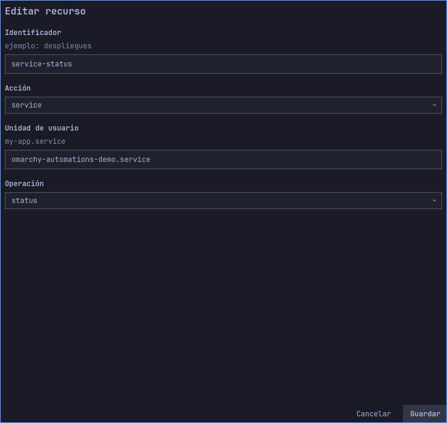
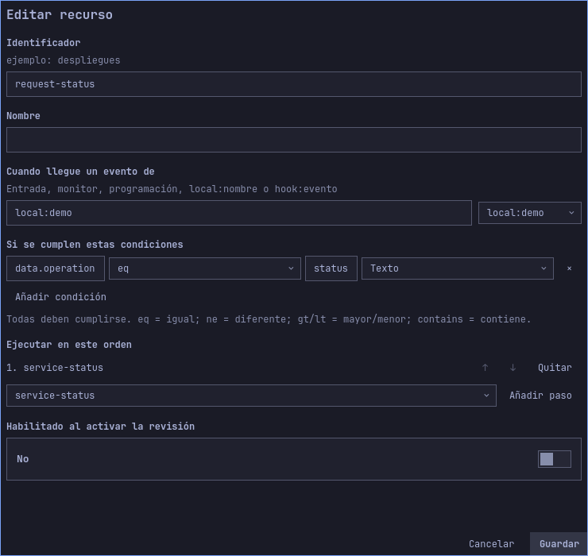

# Controlar un servicio de usuario autorizado

[English](../en/service-example.md) · [Guía de usuario](user-guide.md) · [Otros ejemplos](use-cases.md)

Este ejemplo ofrece dos operaciones fijas sobre un servicio de usuario: comprobar
que esté activo y reiniciarlo. Los datos del evento eligen entre dos flujos
preconfigurados; no proporcionan unidad, ejecutable ni argumentos systemctl arbitrarios.

## Preparar un servicio desechable

Necesitas systemd de usuario operativo. Desde una terminal crea la unidad:

```bash
systemd-run --user --unit=omarchy-automations-demo.service --collect --property=Type=exec -- /usr/bin/sleep 1800
systemctl --user is-active omarchy-automations-demo.service
```

Debe mostrar `active`. El comando no reemplaza una unidad existente con ese nombre;
resuelve el conflicto antes de continuar. El servicio transitorio solo espera y
termina tras 30 minutos si no se reinicia. No se habilita al iniciar sesión ni
instala un archivo permanente. Si termina durante el ejercicio, créalo otra vez.

## Importar e inspeccionar

Exporta el borrador que quieras conservar e importa
[user-service.json](../../examples/use-cases/user-service.json). Ambos flujos se
entregan deshabilitados. Inspecciona estos recursos:

| Recurso | Comportamiento fijo |
|---|---|
| `service-status` | `service`, unidad `omarchy-automations-demo.service`, operación `status` |
| `service-restart` | Misma unidad exacta, operación `restart` |
| `request-status` | Origen `local:service`, condición `data.operation eq status`, paso `service-status` |
| `request-restart` | Mismo origen, condición `data.operation eq restart`, paso `service-restart` |

Habilita ambos flujos en el borrador y guarda. Para construirlo manualmente, crea
primero las acciones y después flujos y condiciones de texto de la tabla. Cada
operación tiene su propia capacidad revisada.

### Recorrido visual

Inspecciona Acciones antes de activar: la operación y el nombre exacto de unidad determinan qué servicio de usuario se controla. El flujo selecciona cuándo se ejecuta.





Las imágenes muestran el borrador importado antes de activar. Los formularios largos se desplazan; los campos fuera del área visible siguen formando parte de la configuración.

## Simular, activar y ejecutar

1. Abre Simular / probar, origen `local:service`, tipo `test` y datos:

   ```json
   {"operation":"status"}
   ```

   Simula sin efectos: solo debe coincidir `request-status`. La simulación no
   consulta systemd.
2. Repite con `{"operation":"restart"}`: solo debe coincidir `request-restart`.
   Con `{"operation":"stop"}` no coincide ninguno; el ejemplo no autoriza
   detener el servicio mediante datos del evento.
3. Revisa capacidades exactas de unidad/operación y activa la revisión.
4. Consulta el identificador del proceso:

   ```bash
   systemctl --user show omarchy-automations-demo.service --property=MainPID --value
   ```

5. Confirma Ejecutar prueba real con `status`. Debe completarse en Historial y
   conservar PID. En servicios de usuario, `status` comprueba **estado activo**:
   un servicio inactivo produce acción fallida, no un informe detallado exitoso.
6. Confirma evento real `restart`. Debe completarse y cambiar PID. Reiniciar
   interrumpe el proceso; usa la unidad desechable para este ejercicio.
7. En Seguridad revoca capacidad de `request-restart` / `service-restart`.
   Envía otro evento real de reinicio. Debe denegar el paso y conservar PID.
   El permiso independiente de estado sigue disponible.

La prueba real usa revisión activa, no cambios sin guardar. Revocar no deshace el
reinicio anterior. Los fallos de acciones de servicio no se reintentan automáticamente.

## Retirar el ejemplo y adaptar a tu servicio

Detén la unidad al terminar:

```bash
systemctl --user stop omarchy-automations-demo.service
```

La unidad transitoria se recoge al quedar inactiva. Deshabilita los flujos del
ejemplo y revisa/activa esa configuración si no deben aceptar más eventos locales.
Para tu servicio, edita unidad exacta de cada acción, simula, guarda y revisa nuevas
capacidades. No supongas que un permiso anterior autoriza otra unidad.

Los servicios del sistema usan otro tipo de acción, `system-service`, que necesita
broker administrativo opcional, política exacta UID/unidad/operación y autorización
Polkit. Comprobar permisos administrativos no inicia ni reinicia nada, ni concede
permiso al flujo. Este ejemplo de servicio de usuario no necesita broker root.

## Alcance de verificación

`TestDocumentedServiceSimulation` carga JSON distribuido y comprueba tres eventos
sin crear ejecuciones. `TestHostDocumentedService` cambia solo nombre de unidad por
uno temporal único, activa configuración en motor real y despacha estado/reinicio
mediante worker. Comprueba conservación/cambio de PID, revocación, dos ejecuciones
completadas y una denegada, y retira su unidad al terminar. No opera servicios
existentes del usuario ni instala broker root.
