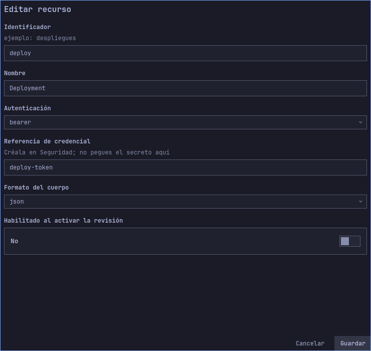
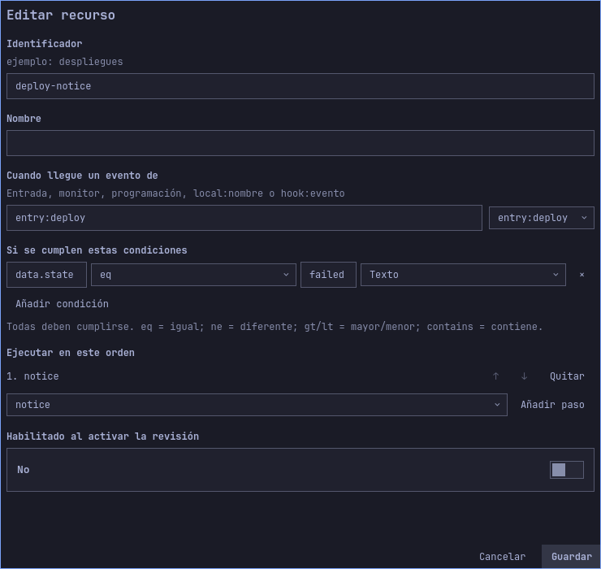
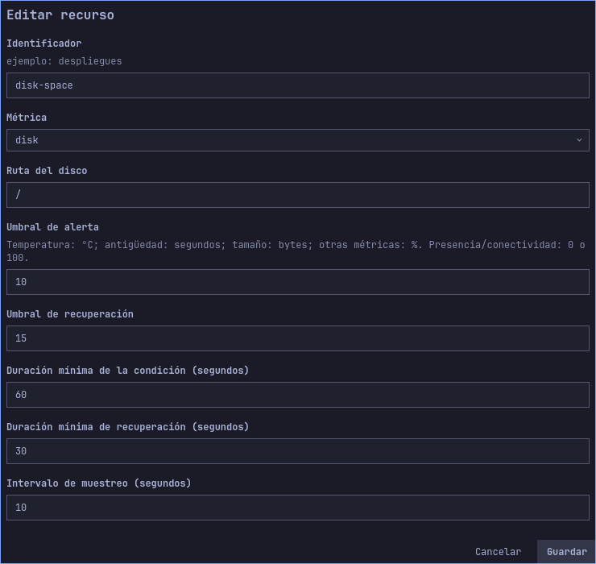
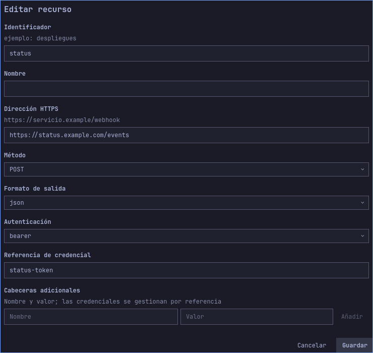
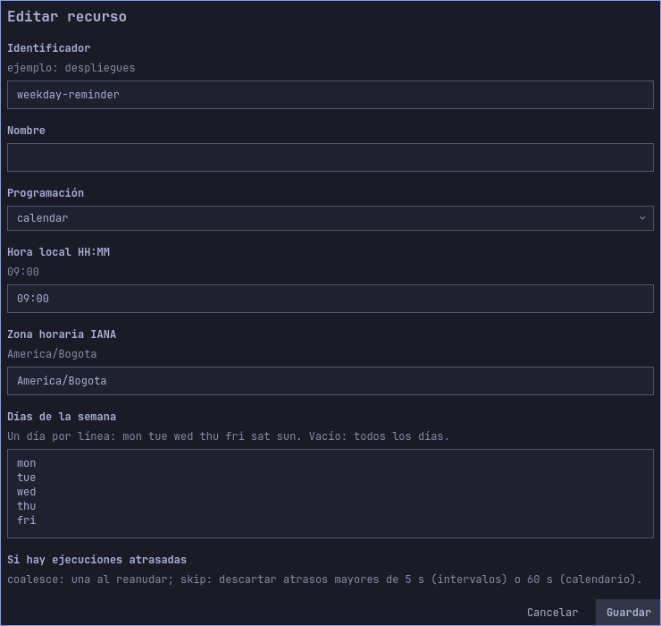
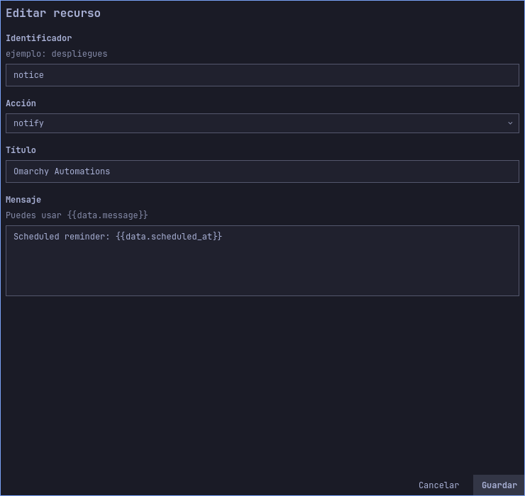

# Ejemplos guiados

[English](../en/use-cases.md) · [Guía de usuario](user-guide.md)

| Más ejemplos completos |
|---|
| [Código local: script tipado y adaptador](code-examples.md) |
| [Proveedor GitHub firmado](provider-example.md) |
| [Servicio de usuario autorizado](service-example.md) |
| [Recuperación de entrega HTTP](recovery-example.md) |
| [Google OAuth](oauth-example.md) |


Estos ejemplos son configuraciones completas independientes, no fragmentos que se
fusionen implícitamente. Importar reemplaza el borrador: exporta primero el actual.
Todos sus orígenes y flujos se entregan deshabilitados. Importar no modifica la
revisión activa. Habilita el flujo correspondiente para simular; habilita su origen
solo cuando quieras activarlo. Las referencias son marcadores, nunca secretos reales.


## Sigue un ejemplo de principio a fin

1. Elige un caso siguiente. Descarga su JSON enlazado o búscalo en
   `examples/use-cases/` dentro del checkout. Usa una ruta absoluta al importar.
2. En el panel elige **Exportar** para conservar el borrador actual y después
   **Importar** con el ejemplo. Importar reemplaza el borrador; no lo activa.
3. Abre las secciones indicadas en el recorrido visual. Pulsa **Editar** junto a
   cada identificador y compara valores con las capturas. Cancelar no lo cambia;
   Guardar actualiza el borrador. Desplaza los formularios largos para ver todo.
4. Habilita el flujo del ejemplo y **Guarda el borrador**. Mantén deshabilitados
   los orígenes automáticos hasta estar listo para recibir eventos reales.
5. Abre **Simular / probar**, introduce origen, tipo y JSON del caso y elige
   **Simular sin efectos**. Compara el flujo coincidente y la acción resuelta con
   el resultado esperado. Prueba también el segundo conjunto de datos.
6. Cuando la configuración sea correcta, prepara credenciales y servicios
   externos, habilita los orígenes deseados y **Revisa y activa**. Comprueba los
   destinos, comandos o servicios exactos que vas a autorizar.
7. Después de un evento real abre **Historial** e inspecciona la ejecución.
   HTTP 202 significa que se aceptó el evento; no demuestra éxito de sus acciones.
   Al terminar, deshabilita flujo/origen de ejemplo y activa esa revisión.


*Introduce origen y JSON del caso elegido. Esta captura genérica muestra el
cuadro de diálogo; sus valores no son los datos de todos los tutoriales.*

| Caso | Simulación correcta | Comprobación tras evento real |
|---|---|---|
| Fallo de despliegue | `failed` coincide con `deploy-notice`; `passed` no | Notificación y ejecución completada |
| Espacio de disco | Alerta y recuperación resuelven un cuerpo JSON de salida | Transición del monitor, estado de entrega y registro del receptor |
| Recordatorio entre semana | La fecha se incorpora al mensaje | Próxima ocurrencia y una notificación |

### Cómo interpretar las capturas

Los formularios rellenados siguientes se renderizan con la UI QML real y los
archivos públicos exactos, en perfiles aislados con tema Tokyo Night.
`scripts/capture-tutorials.py` reproduce las 36 imágenes en inglés/español.
Orígenes y flujos están deshabilitados; no se cargan credenciales ni activan
efectos. Las imágenes guían la configuración y no acreditan conexión real a un proveedor.

## Un webhook que notifica fallos

Importa [webhook-notification.json](../../examples/use-cases/webhook-notification.json)
con el control de importación del panel y la ruta absoluta del archivo. Define
la entrada `deploy`, referencia bearer `deploy-token`, notificación `notice` y
flujo `deploy-notice` con condición `data.state eq "failed"`.

Habilita el flujo en el borrador. Simula origen `entry:deploy`, tipo `webhook`:

```json
{"state":"failed","message":"Build failed"}
```

Debe coincidir un flujo y mostrar cuerpo `Build failed`, sin efectos. Repite con
`{"state":"passed","message":"Build passed"}`: no debe coincidir ningún flujo.

Para un despliegue real, crea `deploy-token` en Seguridad, habilita la entrada
`deploy`, guarda, revisa su capacidad y activa. Configura el emisor con el mismo
valor bearer y formato JSON. Usa un proxy TLS para solicitudes remotas que conserve
`Authorization` y el cuerpo. Su URL termina en `/hooks/deploy`. Envía el cuerpo de
fallo: debe responder HTTP 202 tras persistir y después aparecer una notificación
y una ejecución completada en Historial. Simular no verifica bearer; solo una
solicitud HTTP real comprueba esa autenticación.

### Recorrido visual

Conexiones → Entrada → Editar `deploy`: comprueba autenticación bearer y referencia `deploy-token`. Después Flujos → Editar `deploy-notice`: comprueba origen, condición y paso `notice`.





Las imágenes muestran el borrador importado antes de activar. Los formularios largos se desplazan; los campos fuera del área visible siguen formando parte de la configuración.

## Un monitor de disco con alerta y recuperación de salida

Importa [monitor-outbound.json](../../examples/use-cases/monitor-outbound.json).
Reemplaza `https://status.example.com/events` por tu receptor HTTPS real y crea
su credencial bearer `status-token`. La dirección de ejemplo no es un servicio
operativo. El monitor observa `/`, alerta al cruzar el umbral bajo 10 y se recupera
al cruzar 15, con duraciones de confirmación de 60 y 30 segundos. Muestrea cada
10 segundos y usa una separación entre alertas de 300 segundos.

Habilita `disk-report`. Simula origen `monitor:disk-space`, tipo `alert`:

```json
{"metric":"disk","value":8,"state":"alert"}
```

Debe resolver el cuerpo JSON `{"metric":"disk","state":"alert","value":8}`.
Repite con tipo `recovered` y datos
`{"metric":"disk","value":18,"state":"recovered"}`. Debe coincidir el mismo flujo
con estado `recovered` y valor numérico 18. Simular no envía solicitudes HTTPS.

Para ejecutarlo, habilita el monitor, guarda y revisa los permisos del monitor y
de la acción de salida antes de activar. Los eventos dependen de las lecturas
reales: no llenes el disco para probarlo. Los eventos simulados anteriores verifican
la configuración por separado del monitoreo real. Consulta estado y registros del
receptor cuando ocurra una transición real. Una caída del receptor deja la entrega
pendiente/en reintento o fallida; corrígelo y revisa Historial antes de reenviar los
pasos HTTP que lo permitan.

### Recorrido visual

Monitores → Editar `disk-space`: compara los umbrales y tiempos de confirmación siguientes. Conexiones → Salida → Editar `status`: sustituye la URL ficticia por tu receptor.





Las imágenes muestran el borrador importado antes de activar. Los formularios largos se desplazan; los campos fuera del área visible siguen formando parte de la configuración.

## Un recordatorio entre semana

Importa [scheduled-notification.json](../../examples/use-cases/scheduled-notification.json).
Programa las 09:00 en `America/Bogota`, lunes a viernes, con política `skip` para
atrasos. Cambia hora/zona según tus necesidades; no toma implícitamente la del escritorio.

Habilita `reminder`. Simula origen `timer:weekday-reminder`, tipo `scheduled`:

```json
{"scheduled_at":"2026-09-28T14:00:00Z"}
```

Debe mostrar `Scheduled reminder: 2026-09-28T14:00:00Z`. Un segundo ejemplo,
`{"scheduled_at":"2026-09-29T14:00:00Z"}`, sustituye la fecha del día siguiente.
La simulación demuestra la plantilla, no el funcionamiento del reloj programador.

Habilita la programación, guarda y revisa los permisos de programación y
notificación; después activa. La vista debe mostrar la siguiente ocurrencia futura.
A esa hora debe aparecer una notificación si el motor y la sesión están disponibles.
`skip` descarta ocurrencias de calendario con más de 60 segundos de atraso; elige
`coalesce` si prefieres un recordatorio al volver tras una ausencia. Ninguna opción
despierta el equipo suspendido.

### Recorrido visual

Programaciones → Editar `weekday-reminder`: configura hora, zona y días. Acciones → Editar `notice`: el mensaje incorpora la fecha del evento.





Las imágenes muestran el borrador importado antes de activar. Los formularios largos se desplazan; los campos fuera del área visible siguen formando parte de la configuración.

## Estado de verificación

`TestDocumentedUseCases` carga los JSON distribuidos, los valida, comprueba que
orígenes/flujos estén deshabilitados y simula sus cuerpos con el motor real.
Comprueba que no se creen permisos, ejecuciones ni filas de outbox HTTP. Cubre
alerta y recuperación. No contacta un receptor real, consume credenciales reales
ni acredita cobertura completa de cada opción de la interfaz.

[Más variantes de monitores](monitor-recipes.md): dos configuraciones por métrica.

[Recetas de acciones: todos los tipos y perfiles de comando](action-recipes.md).

## Más variantes de programación

| Tipo | Ejemplo A | Ejemplo B |
|---|---|---|
| `interval` | Cada 300 segundos, `coalesce` | Cada 3600 segundos, `skip` |
| `calendar` | 08:30, `Europe/Madrid`, mon–fri, `skip` | 18:00, `UTC`, sat/sun, `coalesce` |

Crea programaciones separadas con estos valores y un flujo por fuente `timer:TU-ID`.
Para días laborales introduce mon, tue, wed, thu y fri en líneas separadas; para
fin de semana, sat y sun. Una lista vacía ejecuta todos los días. Cada intervalo
nuevo empieza a contar desde su primera evaluación. Reiniciar el motor conserva
el vencimiento guardado. Los calendarios empiezan en la próxima ocurrencia futura;
varias horas diarias requieren varias programaciones. Una hora inexistente por
cambio horario se omite y una hora repetida admite solo su primera ocurrencia.

Con `coalesce`, diez minutos de atraso del intervalo de 300 segundos generan un
solo evento que identifica el primer vencimiento pendiente, no dos eventos para
ponerse al día. Con `skip`, el intervalo de 3600 segundos descarta una ocurrencia
con más de cinco segundos de atraso. En calendario, `skip` tolera sesenta segundos.
Ninguna política despierta el equipo suspendido. Cambiar la configuración reinicia
la programación; activar la configuración idéntica conserva su vencimiento.

Pausar reteniendo admisión permite acumular eventos programados para efectos
posteriores. Pausar rechazando admisión deja el vencimiento pendiente y aplica
la política de atrasos al reanudar. Revocar la programación detiene eventos nuevos,
pero no revoca permisos de acciones para eventos ya encolados. Revisa Historial
antes de reanudar efectos. El panel muestra la próxima ejecución en la zona del
escritorio; `scheduled_at` está en UTC y la zona del calendario sigue siendo la
configurada.

[Formatos de datos y condiciones](payload-recipes.md).

[Autenticación de webhooks: HMAC, Slack, GitHub y bearer](authentication-recipes.md).
