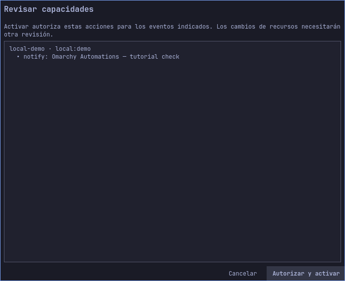
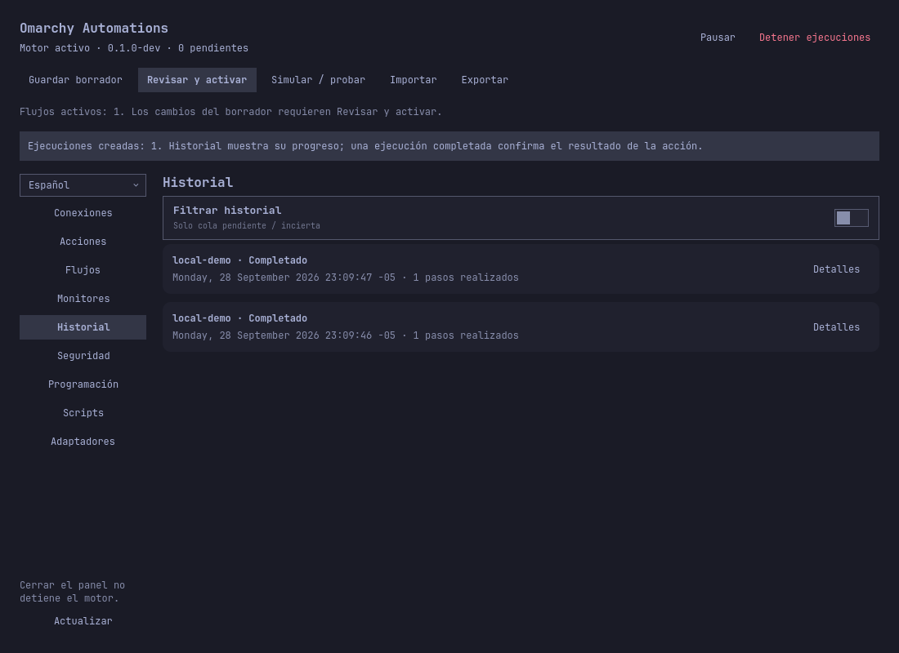

# Omarchy Automations — guía de usuario

[English](../en/user-guide.md) · [Proyecto](../../README.md) · [Ejemplos guiados](use-cases.md) · [Referencia de opciones](options.md) · [Recorrido por la interfaz](interface.md) · [Roadmap](../../ROADMAP.md)

Esta guía describe la versión actual de desarrollo. La revisión bilingüe se
registra en la [auditoría de documentación](../documentation-audit.md). La
validación de entrega continúa; el roadmap separa las comprobaciones externas
y la entrega final. Las capturas distinguen el shell instalado de los renders
de desarrollo en temas claro y oscuro.

## Qué hace el plugin

Un **origen de eventos** alimenta un **flujo**. Todas sus condiciones deben
cumplirse; después se ejecutan sus **acciones** ordenadas con los permisos que
revisaste. Los orígenes incluyen webhooks autenticados, monitores del sistema,
programaciones y eventos locales o de hooks de Omarchy. Las acciones incluyen
notificaciones, peticiones HTTPS de salida, servicios de usuario, comandos/scripts
aprobados, adaptadores y operaciones específicas de Omarchy. Los servicios de
sistema requieren el broker administrativo opcional.

El panel edita un **borrador**. Guardarlo no reemplaza la **revisión activa**.
La simulación usa el borrador sin efectos. Los eventos reales usan la revisión
activa y sus permisos. Cerrar el panel deja el motor funcionando.

El producto se llama Omarchy Automations. Nombres técnicos existentes como
`quatrroctl`, `quatrrod.service`, `QUATRRO_PROFILE` y el identificador de plugin
`quatrro.automations` se conservan por compatibilidad de instalación y datos.

## Instalación y primer inicio

Instala el motor publicado para Linux amd64 con estos dos comandos. No necesitas
Go ni un compilador:

```bash
omarchy plugin add https://github.com/PuroDelphi/omarchy-automations.git --yes
python3 ~/.config/omarchy/plugins/quatrro.automations/scripts/setup.py
```

¿Ya está instalado? Sigue las [instrucciones de actualización o migración](installation.md)
en lugar de agregar otra copia. Esa guía también cubre requisitos, instalación
sin conexión y solución de problemas. La [compilación propia](development.md)
es opcional y está destinada al desarrollo.

El instalador escribe los binarios en `~/.local/bin`, habilita el servicio de
usuario y el plugin. Comprueba que `~/.local/bin` esté en el PATH de tu terminal.
Pulsa el icono de conexiones en la barra de Omarchy para abrir el panel. Su ayuda
emergente muestra conexión, pausa y cola. El idioma inicial es inglés;
selecciona Español en el control de idioma para guardar la preferencia del perfil.

Por ejemplo, conserva inglés en un equipo compartido o elige español para tu
perfil personal. Cambiar el idioma no traduce identificadores, claves JSON,
nombres de servicios ni los mensajes que escribas.

## Primera automatización: una notificación local

1. Abre **Acciones**, crea una acción `notify` con identificador `notice`, título
   `Omarchy Automations` y mensaje `{{data.message}}`.
2. Abre **Flujos**, crea un flujo `local-demo`, origen `local:demo`, sin condiciones
   y con un paso, `notice`. Déjalo habilitado para la activación.
3. Guarda el borrador. Abre **Simular / probar** con origen `local:demo`, tipo `demo`
   y datos `{"message":"Compilación terminada"}`. Elige **Simular sin efectos**.
   Deben aparecer el flujo coincidente y el texto resuelto de la notificación.
4. Cierra el resultado de la simulación y el diálogo del evento de prueba.
   **La simulación solo comprueba el borrador: no envía notificaciones ni crea
   entradas en Historial.**
5. En la barra superior, pulsa **Revisar y activar**. Se abre **Revisar
   capacidades**; abrir ese diálogo todavía no activa nada.
6. Comprueba que aparecen tu flujo (`local-demo`), el origen (`local:demo`) y la
   acción `notify` con el título de tu notificación. Desplázate por la lista si
   hace falta. Pulsa **Autorizar y activar** para conceder las capacidades
   indicadas y activar esa revisión. **Cancelar** conserva la revisión activa
   anterior. Este diálogo no tiene casillas individuales de permisos.
7. Espera el mensaje **Revisión activada. Ya puedes ejecutar la prueba real desde
   Simular / probar.** El indicador sobre las secciones debe mostrar **Flujos
   activos: 1** si este es tu único flujo habilitado. Si editas después el
   borrador, repite los pasos 5–6.



Esta captura muestra el diálogo real de revisión. El perfil de prueba usa el
título `Omarchy Automations — tutorial check`; el tuyo mostrará tu propio título.

8. Abre de nuevo **Simular / probar**, introduce origen `local:demo`, tipo `demo`
   y datos `{"message":"Compilación terminada"}`. Pulsa **Ejecutar prueba real** y
   confirma la advertencia. El botón no está disponible si ningún flujo activo
   usa ese origen.
9. El panel abre **Historial** e informa **Ejecuciones creadas: 1**. Espera a ver
   **Completado** y **1 pasos realizados** en la fila. Pulsa **Actualizar** si
   aún aparece un estado intermedio, o **Detalles** para inspeccionar el resultado.



La captura contiene el resultado de una prueba real de notificación; no es una
maqueta ni un perfil inicial vacío. `Completado` significa que el servicio de
notificaciones aceptó la acción; el modo no molestar puede ocultar el aviso.

| Lo que ves | Significado y siguiente paso |
|---|---|
| La simulación coincide, pero Historial está vacío | Es normal al simular. Revisa, autoriza y activa antes de la prueba real. |
| No hay flujos activos para este origen | Guarda y habilita el flujo, comprueba el origen exacto y pulsa Revisar y activar. |
| Ningún flujo activo coincidió; no se crearon ejecuciones | El evento real no cumplió el origen o las condiciones de un flujo activo. Revisa la revisión activa y los datos de prueba. |
| Ejecución fallida | Abre **Detalles** y comprueba el error de permisos o del servicio de notificaciones. |
| Ejecución completada sin aviso | Revisa las notificaciones del escritorio y el modo no molestar. |

Una segunda prueba real, `{"message":"Respaldo comprobado"}`, cambia el mensaje
sin cambiar la acción. El origen `local:other` no debe coincidir con ese flujo.
El equivalente importable es [notification.json](../../examples/notification.json).
Importar deshabilita los flujos; vuelve a habilitarlos antes de revisar y activar.

## Conexiones y credenciales

Crea credenciales en **Seguridad → Crear o rotar credencial**. Elige una referencia
local como `deploy-signing` o `status-api`; las conexiones guardan esa referencia,
no el valor. Los valores genéricos requieren 16–8192 bytes, sin CR, LF ni NUL. El almacén
del escritorio necesita Secret Service disponible; el backend de archivo privado
seleccionado expresamente **no está cifrado**. No hay cambio automático de backend.

Reutilizar una referencia rota su valor para solicitudes posteriores. Eliminarla
hace que las conexiones fallen hasta restaurar un valor adecuado. Ninguna de las
dos operaciones deshace una solicitud ya autenticada o enviada. No escribas secretos
en cabeceras ordinarias, mensajes ni scripts: esos campos se exportan en la
configuración. Las operaciones CLI con secretos deben leer su entrada con `--stdin`.

### Webhooks de entrada

En **Conexiones**, crea una entrada, selecciona autenticación y formato del cuerpo,
y referencia su credencial. La dirección local es `POST
http://127.0.0.1:8791/hooks/ID_ENTRADA`; consulta el estado para conocer el listener
real. Un flujo escucha `entry:ID_ENTRADA`. Un emisor remoto necesita un proxy TLS
configurado expresamente; el motor permanece en loopback.

Opciones de autenticación:

- `hmac`: solicitudes genéricas firmadas con timestamp e identificador de entrega.
- `github`: firma SHA256 del cuerpo de GitHub; filtra campos del cuerpo autenticado.
- `slack`: Signing Secret de Slack con comprobación de firma y timestamp.
- `bearer`: credencial bearer compartida; usa TLS para transporte remoto.

Por ejemplo, usa la entrada `deploy` con JSON y HMAC para despliegues, o `mentions`
con autenticación Slack y JSON para menciones de una aplicación. Crea entradas
separadas si la misma integración necesita distintos formatos de cuerpo.

JSON produce campos como `data.message`. El formulario produce campos por nombre;
raw proporciona `data.body` y `data.content_type`. XML se normaliza bajo `data.xml`;
el texto multipart está en `data.fields` y los metadatos/contenido de archivos en
`data.files`. Los archivos recibidos se guardan como datos del evento, sin ejecutarse
ni escribirse como archivos del host. El límite HTTP es 256 KiB; XML/multipart
normalizados tienen límites adicionales.

Una respuesta aceptada significa que el evento se guardó, no que sus acciones
terminaron. Slack usa HTTP 200 después de persistir; las entradas ordinarias usan
202. Consulta Historial.

### Destinos de salida

Crea primero un destino HTTPS y después una acción `http` que lo referencie.
Selecciona POST, PUT o PATCH; salida JSON, formulario o raw; y autenticación
ninguna, HMAC, bearer o Google OAuth2 compatible. Las cabeceras adicionales son
configuración ordinaria que se incluye en las exportaciones.

Por ejemplo, envía JSON `{"message":"{{data.message}}"}` a un receptor de estado,
o formulario `{"state":"{{type}}","source":"{{source}}"}` a una API de formularios.
Para raw usa texto como `Resultado: {{data.message}}`.
Las plantillas JSON/formulario deben ser JSON válido. Los valores se codifican
tras sustituirlos, por lo que el texto del evento no se convierte en código ejecutable.

La red privada se bloquea salvo que el `host:puerto` exacto del destino aparezca
en sus excepciones; ejemplos: `status.internal:443` y `[fd00::10]:8443`. Se mantiene
la validación TLS. No se siguen redirecciones.

### Google OAuth2

Elige autorización en navegador con tu propio cliente Google Desktop, los scopes
necesarios y una referencia local. Guardar inicia una sesión de diez minutos;
usa **Abrir consentimiento en el navegador**, revisa la página de Google y consulta
la conexión en Seguridad. También puedes importar un refresh token existente con
sus credenciales de cliente. Guardar credenciales no concede permisos a flujos.

Este modo admite actualmente solo `www.googleapis.com` y `calendar.googleapis.com`
por HTTPS en el puerto 443. Sigue pendiente una prueba integral con cuenta Google
real; las pruebas con fixtures no acreditan compatibilidad con cualquier API de
Google. Eliminar localmente no revoca el consentimiento en Google.

## Acciones y flujos

| Acción | Cómo usarla | Dos ejemplos |
|---|---|---|
| `notify` | Define título y mensaje; admite referencias al evento. | Compilación terminada; espacio de disco recuperado. |
| `http` | Selecciona destino registrado y plantilla del cuerpo. | Comunicar una alerta; enviar el resultado de un despliegue. |
| `service` | Define una `.service` exacta de usuario y status/start/stop/restart. | Consultar `backup.service`; reiniciar tu `worker.service`. |
| `omarchy` | Selecciona una operación ofrecida. | `theme.current` consulta el tema; `system.lock` bloquea la sesión. |
| `command` | Elige ejecutable/argumentos fijos o un perfil de directorio. | `/usr/bin/true` como comprobación mínima; `file-exists` en un montaje aprobado. |
| `script` | Prepara código y parámetros tipados, después elige su revisión exacta. | Validar un nombre de proyecto; procesar un contador entero acotado. |
| `adapter` | Prepara el adaptador local y selecciona su revisión. | Normalizar campos; calcular datos para una notificación posterior. |
| `system-service` | Requiere política administrativa y autorización del broker. | Consultar un servicio permitido; reiniciar uno autorizado expresamente. |

Los argumentos fijos de comandos usan uno por línea, sin expansión de shell.
Comandos/scripts no tienen red IP ni acceso al HOME por defecto. Los directorios
autorizados exponen todo el árbol seleccionado: lectura para inspección o lectura/
escritura para cambios. Prepara su identidad, elige un destino como `/work/data`
y revisa el permiso resultante. Preparar no concede permisos.

Para scripts, elige Bash o Python, define parámetros ordenados string/integer/boolean
y prepara el código. En su acción elige **Usar esta revisión y reiniciar parámetros**
y proporciona cada literal o campo del evento. Por ejemplo, vincula la cadena
acotada `message` a `data.message`, o fija el entero `count` en `3`. Cambiar código
o contrato exige una nueva revisión y aprobación. Los adaptadores transforman
datos del evento; no se ejecutan durante la simulación.

El origen del flujo debe coincidir exactamente. Todas las condiciones deben
cumplirse. Los operadores son `eq`, `ne`, `gt`, `lt` y `contains` para texto;
selecciona el tipo texto/número/booleano correcto. Por ejemplo, `data.state eq
"failed"` selecciona fallos y `data.percent gt 90` un umbral numérico. Los campos
ausentes no coinciden, tampoco con `ne`. Los pasos siguen el orden indicado.
Un adaptador puede producir campos para los siguientes pasos.

[Hooks de Omarchy y administración opcional](system-integration.md) explica instalación de hooks, dos ejemplos de eventos y el ciclo del broker administrativo.

## Monitores y programaciones

Un monitor emite `alert` y `recovered` desde `monitor:ID`; los de journal emiten
`journal`. Crea flujos para ese origen y, si hace falta, una condición sobre `type`.
Por ejemplo, un flujo notifica con `type eq alert` y otro envía la recuperación
al exterior con `type eq recovered`.

CPU y memoria miden porcentaje usado. Disco y batería miden porcentaje disponible.
CPU, memoria, antigüedad/tamaño de archivo y temperatura alertan al subir; disco,
batería y métricas de presencia/conectividad, al bajar. Define un umbral diferente
de recuperación para evitar cambios repetidos alrededor de un único valor.

Ejemplos: disco con umbral 10/recuperación 15 detecta poco espacio libre; CPU con
umbral 90/recuperación 75 detecta uso alto sostenido. Ajusta duración de confirmación,
duración de recuperación, muestreo y separación entre alertas a la señal. Una
lectura no disponible no se interpreta como cero. No son comprobaciones en tiempo real.

Otras métricas cubren un servicio de usuario, tu ejecutable de proceso, existencia/
antigüedad/tamaño de archivo, sensor térmico, conectividad HTTPS HEAD y prioridad
del journal de una unidad de usuario. Los monitores de archivos solo inspeccionan
metadatos y rechazan enlaces simbólicos. Los eventos journal no incluyen el texto
del mensaje. Reiniciar el cursor comienza desde ese momento y no recupera entradas antiguas.

Las programaciones emiten `scheduled` desde `timer:ID`. Los intervalos admiten de
5 segundos a 365 días. Los calendarios usan HH:MM, zona IANA explícita y días
opcionales. Por ejemplo, cada 300 segundos, o a las 09:00 en `America/Bogota` de
`mon` a `fri`. Sin días se ejecuta diariamente; crea programaciones separadas para
varias horas.

`coalesce` emite un evento tras vencimientos acumulados. `skip` descarta los que
llegan con más de 5 segundos de atraso en intervalos o 60 en calendarios. El motor
no despierta el equipo suspendido. La pausa de efectos y los atrasos de programación
son controles distintos; consulta la próxima ocurrencia en la vista de programación.

## Operación, recuperación y datos

**Pausar** conserva eventos entrantes pero detiene el despacho de trabajos
posteriores. **Reanudar** continúa. **Detener ejecuciones** pide confirmación,
cancela trabajos en cola e intenta detener procesos activos. No deshace efectos externos.

En Historial, usa el filtro de cola pendiente/incierta, sus páginas y Detalles.
Un paso completado puede pertenecer a una ejecución todavía pendiente. Un paso
`denied` necesita el permiso revisado adecuado; un resultado `uncertain` requiere
inspeccionar el efecto externo real antes de decidir qué hacer.

Para pasos HTTP fallidos/cancelados, corrige el receptor y elige **Reenviar HTTP**.
La confirmación reutiliza cuerpo y clave de idempotencia originales. Los errores
de transporte, 408, 429 y 5xx pueden reintentarse automáticamente hasta ocho veces
o 24 horas. El receptor debe implementar idempotencia para evitar duplicados.
Por ejemplo, repara un receptor caído antes de reenviar, o restaura una credencial
borrada antes del siguiente intento automático pendiente. Comandos/scripts no se
reintentan automáticamente.

Seguridad muestra permisos activos y permite revocarlos. Revocar una acción impide
futuras ejecuciones bajo ese permiso; no deshace acciones completadas. Revocar un
monitor/programación detiene eventos nuevos, no los permisos independientes de
acciones del trabajo ya encolado.

Los límites iniciales son 10.000 eventos, 64 MiB de datos, 7 días de historial
terminal y 30 días de deduplicación. Se conserva trabajo pendiente/incierto. Llegar
a una cuota rechaza eventos nuevos en lugar de borrar trabajo sin terminar. Por
ejemplo, inspecciona entregas pendientes antes de ampliar límites, o exporta un
diagnóstico si fallan eventos nuevos sin un error de configuración evidente.

Importar lee un JSON local al borrador y deshabilita entradas, flujos, monitores y
programaciones. No reemplaza la revisión activa ni concede permisos. Exportar
escribe una **ruta absoluta `.json` nueva**, sin sobrescribir; excluye valores del
almacén de credenciales pero incluye tu texto ordinario de configuración. El
diagnóstico contiene versiones, contadores y estado operativo, sin configuración,
URLs, cuerpos ni valores de credenciales. Ninguna exportación se sube automáticamente.

## Actualización, retirada y solución de problemas

Revisa el trabajo pendiente/en ejecución/incierto en Historial y actualiza:

```bash
omarchy plugin update quatrro.automations
python3 ~/.config/omarchy/plugins/quatrro.automations/scripts/setup.py --update
```

Para desinstalar:

```bash
python3 ~/.config/omarchy/plugins/quatrro.automations/scripts/setup.py --uninstall
omarchy plugin remove quatrro.automations
```

El instalador conserva datos, credenciales y respaldos. Las instalaciones antiguas
gestionadas desde fuentes deben usar los comandos de [migración](installation.md)
desde su checkout original. Consulta los [detalles del instalador](../installation.md)
para restaurar datos: exige detener el motor y revisar los permisos antes de
reanudar los datos restaurados.

Los hooks instalados por separado con `omarchy hook install` no pertenecen al
instalador del plugin y se conservan. Revisa y retira únicamente tu hook de
automatización si ya no lo necesitas; consulta [integración del sistema](system-integration.md).
Se conservan otros plugins, hooks y preferencias del shell. El broker
administrativo opcional tiene su propio procedimiento de retirada en esa guía.

Si falla detener el servicio o deshabilitar el widget, la desinstalación se detiene
antes de retirar archivos propios. El motor puede haber quedado detenido: resuelve
el error indicado antes de reintentar, o arráncalo con
`systemctl --user start quatrrod.service` si quieres seguir usando la instalación.
Un recibo ausente o un archivo propio modificado requiere investigación; no omitas
las comprobaciones de propiedad ni borres recursivamente el directorio del plugin.

| Síntoma | Qué revisar |
|---|---|
| Panel desconectado | `systemctl --user status quatrrod.service`, después `quatrroctl status`; comprueba que usan el mismo perfil. |
| Componentes incompatibles | Recompila/reinstala juntos motor, CLI e interfaz; conserva los datos. |
| La simulación coincide pero el evento real no hace nada | Revisión activa, recursos habilitados, pausa, permisos e Historial. |
| No aparece la notificación | Servicio/sesión de notificaciones y modo no molestar. |
| Entrada rechazada | Referencia de credencial, cuerpo/firma originales, timestamp y formato configurado. |
| Salida rechazada o fallida | HTTPS/TLS, excepción privada exacta, credencial y detalles de intentos. |
| Falla la activación de comandos | systemd de usuario/Bubblewrap y soporte del aislamiento requerido. |
| Falla la importación | JSON regular con ruta absoluta, esquema compatible, tamaño y errores de validación. |

## Glosario y publicación

**Borrador**: configuración editable. **Revisión**: configuración activada fija.
**Permiso**: autorización ligada a recursos exactos revisados. **Entrada**: endpoint
receptor. **Destino**: dirección HTTPS de salida registrada. **Outbox**: cuerpo y
estado persistidos de una entrega. **Incierto**: el efecto pudo ocurrir sin quedar
confirmado en el estado guardado. **Referencia de credencial**: identificador local,
nunca el secreto en sí.

El repositorio previsto es `PuroDelphi/omarchy-automations`. El inicio de sesión
usa la CLI de GitHub preparada en esta máquina; no publica archivos:

```bash
/home/macondo/Work/.quatrro-tools/github-cli/gh auth login --hostname github.com --git-protocol https --web
/home/macondo/Work/.quatrro-tools/github-cli/gh auth setup-git --hostname github.com
```

Autentícate en el navegador; no pegues tokens en el chat. Publicar todavía requiere
validación final, revisión de archivos, tu identidad elegida de autor Git e
inspección del historial remoto existente. El force push no forma parte del inicio.

[Procedimiento completo de primera publicación](github.md): acceso, identidad de autor, primer commit, historial remoto existente y comprobación del push.

[Recursos medidos y límites de admisión](performance.md) documenta la prueba de reposo/carga instalada y su alcance.

[Límites de seguridad y verificación](security.md) explica el modelo de amenazas, las comprobaciones y los límites de integración restantes.
